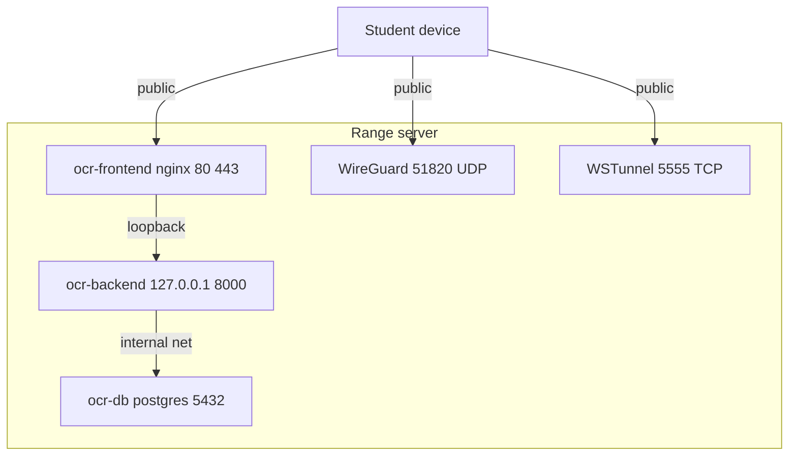

# Prerequisites and Sizing

Before you install OpenCyberRange you size the host, open the right ports, and confirm Docker is available. Read this page first, then follow either [Local Deployment](02_Local_Deployment.md) or [Cloud Deployment](03_Cloud_Deployment.md).

## Operating system

Use Ubuntu 22.04 LTS or a newer Debian-based distribution. The setup script installs all dependencies through `apt`, so a clean server install is the simplest starting point.

## Hardware

The host runs three core containers plus every lab container students spawn. Size for the largest class you expect to run at once.

| Resource | Minimum | Recommended (20+ students) |
|----------|---------|----------------------------|
| CPU cores | 4 | 8 or more |
| RAM | 32 GB | 64 GB |
| Disk (evaluation) | 100 GB | 100 GB |
| Disk (production, prebuilt images) | 500 GB | 500 GB |

CPU core count matters beyond raw throughput: the backend computes its worker count from the host CPU, so an undersized processor lowers concurrency. See [Architecture](06_Architecture.md) for the worker formula.

Prebuilt lab images consume roughly 200 GB on a production host. An evaluation install that builds images on demand fits in 100 GB.

## Memory and RangeBox capacity

RAM is the resource that decides how large a class the host can serve at once, and most of it goes to RangeBoxes, the in-browser Kali and Ubuntu desktops students use when they skip the VPN. Each tenant has a predictable footprint:

| Tenant | Approximate RAM | When it runs |
|--------|-----------------|--------------|
| Base platform (backend, database, frontend, VPN manager) | ~3 GB | Always |
| Each RangeBox desktop | 2 GB hard cap | Per active box |

The platform sizes RangeBox concurrency itself: it starts as many RangeBoxes as the server's free memory can hold, keeping a reserve (8 GB by default) for everything else, and the capacity meter on the dashboard reflects what is actually available. You do not hand-tune a box count. Two environment variables adjust the behavior if you need to:

- `RANGEBOX_MEM_RESERVE_GB` raises or lowers the memory kept free for the platform.
- `MAX_CONCURRENT_RANGEBOXES` pins a fixed cap and disables the automatic sizing.

A rough budget for planning: `RAM = 3 GB base + (peak concurrent RangeBoxes x 2 GB) + 8 GB reserve`. A 25-student class fits comfortably in 64 GB.

## Network ports

The platform exposes a small, fixed set of ports. The backend API is never public.

| Port | Protocol | Exposure | Purpose |
|------|----------|----------|---------|
| 80 | TCP | Public | Frontend HTTP, redirects to HTTPS when a cert is present |
| 443 | TCP | Public | Frontend HTTPS |
| 51820 | UDP | Public | WireGuard VPN |
| 5555 | TCP | Public | WSTunnel fallback for VPN over WebSocket |
| 8000 | TCP | Loopback only | Backend API, bound to 127.0.0.1 |
| 5432 | TCP | Internal | PostgreSQL, container network only |

The diagram shows which surfaces face the internet and which stay on the host.



!!! warning "Never expose port 8000"
    The backend binds to 127.0.0.1:8000 inside the compose file. Publishing it to a public interface would expose the full API surface. Leave the binding as it is.

## Docker

The installer runs preflight checks and installs Docker Engine and Docker Compose v2 if they are missing, then adds your user to the `docker` group.

!!! warning "Log out after the group is added"
    Docker group membership takes effect on your next login. If you run the installer and immediately call `docker ps` in the same shell, it fails with a permission error. Log out and back in, then continue.

## Getting the source

Clone the repository into a directory named `opencyberrange`. The runtime directory and the helper scripts both assume that name.

```bash
git clone https://github.com/syntaxoverride/opencyberrange.git
cd opencyberrange
```

The runtime directory is `~/opencyberrange`. Deployment scripts live in the repository root under `scripts/`.

!!! tip "Next step"
    For a classroom on one LAN, go to [Local Deployment](02_Local_Deployment.md). For an internet-reachable range, go to [Cloud Deployment](03_Cloud_Deployment.md).
