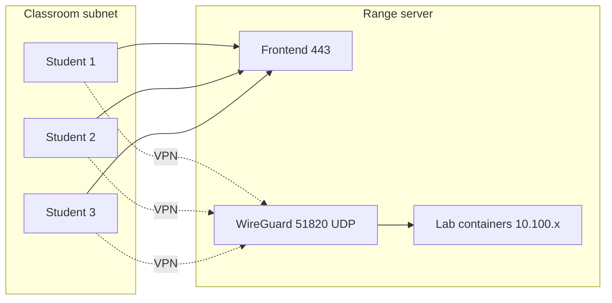

# Local Deployment

You install OpenCyberRange for a classroom on a single LAN, where every student reaches the server on the same subnet. The install uses one script that opens with the deployment-scenario question, asks a few more prompts as it runs, and finishes with a self-signed TLS certificate that the frontend wires in automatically.

## Prerequisites

- A sized host that meets [Prerequisites and Sizing](01_Prerequisites.md).
- The repository cloned to `~/opencyberrange`.
- Root or `sudo` access on the host.

## Steps

1. From the repository root, run the master installer as root:

   ```bash
   sudo bash scripts/setup-range-server.sh --install
   ```

   !!! warning "Run with sudo as your normal login user, not from a root shell"
       Run the installer from the clone in your home directory as your normal login user with `sudo`, exactly as shown above. Do not run it from inside a root shell (`sudo su` or `su -`): the platform installer refuses a direct root run and tells you to use `sudo bash`, so it installs to your home directory instead of `/root`.

2. When the script prompts for the deployment scenario, choose option 1, **Local network only**. The choice sets the deployment mode and selects the self-signed certificate path instead of a public TLS flow.

   !!! note "One script, both ranges"
       The same script installs both local and internet ranges. The deployment scenario is a single choice inside that script, not a separate installer. It is the first of several prompts; the rest come later in the run (see step 3).

3. Let the phases run, and answer two more prompts partway through. The script installs packages, enables IP forwarding, configures WireGuard, installs the Peer Manager API, applies the VPN firewall rules, opens the required ports if a host firewall (ufw) is active, and installs the platform (Docker containers, database, and admin). It then asks whether to discover labs into the database (default yes) and whether to pre-build lab images now (default no, since it can take 10 to 60 minutes or longer). After those answers it runs verification.

4. The local path generates a self-signed certificate. The installer writes `platform/certs/selfsigned.crt` and `platform/certs/selfsigned.key`. The frontend entrypoint detects both files on start and swaps to the SSL nginx configuration. If no certificate is present the frontend serves plain HTTP.

5. If you generate or replace the certificate by hand, restart the frontend so the entrypoint picks it up:

   ```bash
   cd ~/opencyberrange && docker compose up -d frontend
   ```

6. From a student machine on the LAN, browse to `https://<server-ip>/`. The first-run Setup wizard loads.

**What you should see:** the browser warns about the self-signed certificate, you accept it, and the platform redirects to the Setup wizard. Complete the wizard as described in [Post Installation](04_Post_Installation.md).

## LAN topology

The diagram shows students on the same subnet reaching the server over HTTPS and WireGuard, with lab containers living on the internal 10.100.x ranges.



## Gotchas

!!! warning "Self-signed certificate SAN must match"
    Modern browsers reject a certificate that has only a Common Name. The certificate generator builds a Subject Alternative Name, so make sure the IP address or hostname students actually type is included. A mismatched SAN produces a hard TLS error, not just a warning.

!!! warning "Self-signed warnings are expected"
    Students see a browser certificate warning on a LAN install. Tell them to accept it. The warning is normal for self-signed TLS and does not mean the install failed.

If the platform does not load or VPN downloads fail, see [Lab Fails to Start](../07_Troubleshooting/03_Lab_Fails_to_Start.md) and [VPN Connection Problems](../07_Troubleshooting/04_VPN_Connection_Problems.md).
