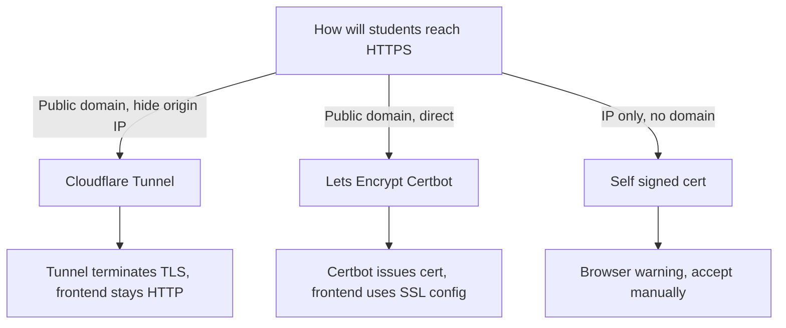
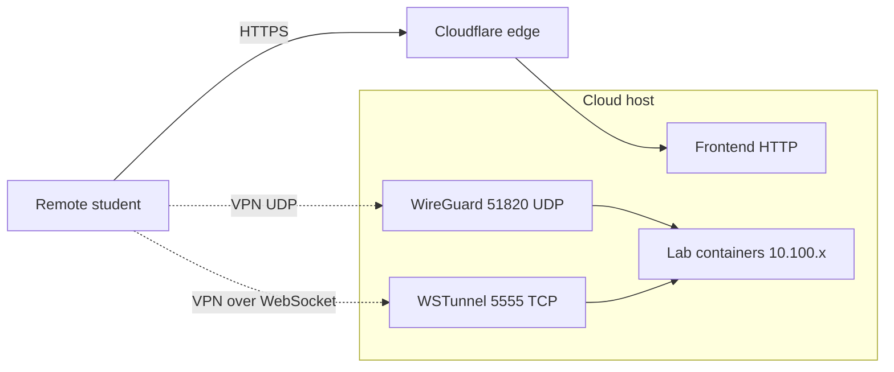

# Cloud Deployment

You install OpenCyberRange on an internet-reachable host so students connect from anywhere. The install uses the same script as a local deployment, but you choose the internet scenario, open ports in the provider firewall, and pick a TLS strategy.

!!! note "Not yet verified on a cloud provider"
    These steps follow the same installer as a local deployment, which is the
    path that has been run end to end. A cloud install has not, so expect to
    adjust firewall rules and the VPN endpoint to suit your provider.

## Prerequisites

- A sized host that meets [Prerequisites and Sizing](01_Prerequisites.md).
- The repository cloned to `~/opencyberrange`.
- Root or `sudo` access on the host.
- Access to the provider firewall or security group.

## Steps

1. From the repository root, run the master installer as root:

   ```bash
   sudo bash scripts/setup-range-server.sh --install
   ```

2. When the script prompts for the deployment scenario, choose option 2, **Over the internet / cloud**.

3. Open these ports in the provider firewall or security group:

   | Port | Protocol | Purpose |
   |------|----------|---------|
   | 443 | TCP | Frontend HTTPS |
   | 51820 | UDP | WireGuard VPN |
   | 5555 | TCP | WSTunnel fallback for VPN over WebSocket |

4. The installer detects the WireGuard endpoint from the server public IP using a fallback chain that ends with `curl ifconfig.me`. The detected endpoint is written into the VPN configs students download.

5. Choose a TLS strategy using the decision flow below, then finish the install.

**What you should see:** the verification phase reports the containers running, and browsing to your public hostname loads the first-run Setup wizard. Complete it as described in [Post Installation](04_Post_Installation.md).

## Choosing a TLS strategy

The diagram shows the three supported ways to terminate TLS for a cloud range.



### Option A: Cloudflare Tunnel (recommended)

Run `cloudflared` to publish the frontend through a Cloudflare Tunnel. The tunnel terminates TLS, so the frontend stays HTTP-only behind it. Only 51820/UDP and 5555/TCP need direct exposure on the host.

!!! warning "Cloudflare Tunnel cannot proxy UDP"
    A tunnel carries HTTP, not WireGuard's UDP. Port 51820/UDP must stay directly reachable on the host, or students fall back to WSTunnel over 5555/TCP. Plan the security group accordingly.

### Option B: Let's Encrypt with Certbot

Issue a certificate with Certbot for a public domain that points at the host. The frontend entrypoint serves the SSL configuration once the certificate is in place.

### Option C: Self-signed

For an IP-only host with no domain, the self-signed path works the same as a [Local Deployment](02_Local_Deployment.md), with the expected browser warning.

## WSTunnel for restrictive networks

Some student networks block UDP entirely. WSTunnel wraps the VPN inside a WebSocket over 5555/TCP. The installer sets it up through `scripts/setup-wstunnel.sh` and enables the `ocr-wstunnel.service` systemd unit. Students who cannot reach 51820/UDP use the WSTunnel path described in [VPN Overview](../05_VPN_Setup_Guide/01_VPN_Overview.md).

## Cloud topology

The diagram shows a remote student reaching the frontend through the tunnel while VPN traffic takes the direct UDP path.



## Gotchas

!!! tip "Any Docker-capable cloud VM works"
    Every lab runs as a Docker container, so a standard shared-CPU cloud VM is fully sufficient. You do not need nested virtualization, `/dev/kvm`, or a bare-metal host.

!!! warning "Empty endpoint breaks VPN downloads"
    If the detected WireGuard server endpoint or public key is empty, the installer prints explicit warnings and students cannot download working VPN configs. Confirm the endpoint resolved correctly before class. See [VPN Connection Problems](../07_Troubleshooting/04_VPN_Connection_Problems.md).
