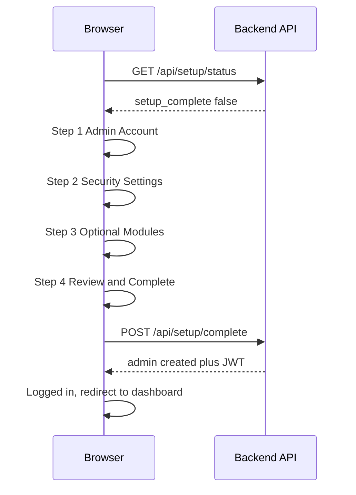
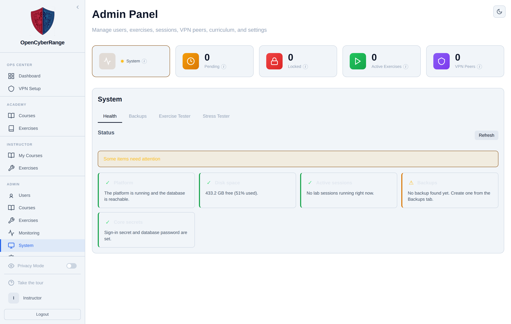

# Post Installation

After the install finishes you complete the first-run Setup wizard, create the admin account, and verify the platform is healthy. You do this once, the first time anyone opens the platform.

!!! note "Lab environments keep building after the install"
    The installer hands you the platform quickly, then pre-builds every lab image in the background so you can set up the range right away instead of waiting. An exercise shows **preparing** until its image is built, then launches instantly; Level-1 labs build first, and a banner on the dashboard shows how many are ready.

## Prerequisites

- A finished [Local Deployment](02_Local_Deployment.md) or [Cloud Deployment](03_Cloud_Deployment.md).
- A browser that can reach the server.

## The first-run Setup wizard

When the database holds no users, the navigation guard checks `/api/setup/status`, sees that setup is incomplete, and redirects the browser to `/setup`. The wizard has four steps.

The diagram shows the wizard sequence from the first page load to the admin landing on the dashboard.



### Step 1: Admin Account

Fill the Username, Email, Password, and Confirm Password fields, then click **Next**. The password must be at least eight characters with an uppercase letter, a lowercase letter, and a digit. Use a strong value such as `ChangeThisNow#2026`. If the installer set a setup token, this step also shows a **Setup token** field; paste the token the installer printed (see the note below) before you click **Next**.

### Step 2: Security Settings

Set the **Require Admin Approval** toggle. With approval on, new registrations wait in the pending queue until an admin approves them. Click **Next**.

### Step 3: Optional Modules

Review the optional modules step and click **Next**.

### Step 4: Review & Complete

Review your choices and confirm. The wizard posts to `/api/setup/complete`, which creates the admin account, seeds defaults, and returns a JWT so you are logged in immediately as the admin.

!!! note "Setup token"
    The installer generates a one-time **setup token** and prints it at the end of its output (it is also written as `SETUP_TOKEN` in the platform's `.env`). The wizard's **Admin Account** step will not create the admin account without it, so nobody who reaches the server first can claim the admin account. Copy the token from the install output into the **Setup token** field, then delete the `SETUP_TOKEN` line from `.env` once your admin account exists. Isolated installs that leave the token unset do not show this field.

!!! warning "The wizard runs once"
    Setup is single-shot. The backend guards `/api/setup/complete` with an advisory lock and the status check, so a second run returns an error. Once any user exists, the wizard never renders again.

!!! note "If a default admin was already seeded"
    This edition creates the first administrator only through the first-run Setup wizard, which prompts for your own username and password. There is no seeded default admin and no default password to change.

## Verifying the install

Confirm the platform is up by logging in as the admin and opening the System tab in the admin panel.

<figure markdown>



<figcaption>The admin System tab on a healthy install confirms the platform is running.</figcaption>
</figure>

From the server shell, run the verification checks:

```bash
cd ~/opencyberrange
docker compose ps
curl -s localhost:8000/health
wg show
sysctl net.ipv4.ip_forward
```

| Check | Expected result |
|-------|-----------------|
| `docker compose ps` | `ocr-frontend`, `ocr-backend`, `ocr-db` running |
| `curl localhost:8000/health` | A healthy JSON response from the backend |
| `wg show` | The WireGuard interface and its public key |
| `sysctl net.ipv4.ip_forward` | `net.ipv4.ip_forward = 1` |

Finish by spawning a test lab from the Exercises catalog, then connect over the VPN and ping the lab target. See [Launching a Lab](../02_Student_Guide/04_Launching_a_Lab.md) and [Testing Your Connection](../05_VPN_Setup_Guide/07_Testing_Your_Connection.md).

!!! note "Updating later: use sudo, not a plain git pull"
    The installer and updater run as root under `sudo`, so they pull and write logs as root and leave root-owned files in your clone (its `.git` metadata, `scripts/install.log`, and on updates `scripts/deploy.log`). Update the supported way, with `sudo bash scripts/deploy-updates.sh`, which pulls the latest and redeploys as root. A plain `git pull` as your normal user can fail with permission errors on those root-owned files; if it does, reclaim ownership with `sudo chown -R "$USER:$USER" ~/opencyberrange` and pull again.

If login fails after setup, see [Login Issues](../07_Troubleshooting/01_Login_Issues.md).
