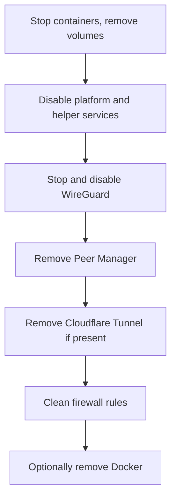

# Uninstallation

You remove OpenCyberRange when you decommission a range. Teardown happens in a fixed order: stop the containers and disable the platform service first, then remove the VPN, the helper services, and finally the firewall rules. Order matters because the firewall re-applies itself when the backend starts.

## Prerequisites

- Root or `sudo` access on the host.
- A backup of any data you want to keep (see the warning below).

!!! warning "Back up the database first"
    `docker compose down -v` deletes the `postgres_data` volume, which holds every account, course, and result. The deletion is irreversible. If you need the data, run `pg_dump` against the `ocr-db` container before you tear anything down.

## Teardown order

The diagram shows the order. Work top to bottom so the firewall is the last thing you flush.



## Steps

1. Stop the containers and remove their volumes, then remove the runtime directory:

   ```bash
   cd ~/opencyberrange
   docker compose down -v
   sudo rm -rf ~/opencyberrange
   ```

2. Remove the lab base images you no longer need, such as the RangeBox and UbuntuBox images:

   ```bash
   docker image ls | grep -E 'rangebox|ubuntubox'
   docker image rm <image-id>
   ```

3. Disable the platform and helper systemd units so nothing re-creates firewall rules on the next boot:

   ```bash
   sudo systemctl disable --now ocr-platform.service
   sudo systemctl disable --now ocr-vpn-firewall.service
   sudo systemctl disable --now ocr-wstunnel.service
   sudo systemctl disable --now docker-wireguard-watcher.service
   ```

4. Stop and disable WireGuard, then remove its configuration:

   ```bash
   sudo systemctl disable --now wg-quick@wg0
   sudo rm -rf /etc/wireguard/*
   ```

5. Stop and disable the Peer Manager, then remove its directory:

   ```bash
   sudo systemctl disable --now ocr-peer-manager.service
   sudo rm -rf /opt/ocr-peer-manager
   ```

6. Remove the Cloudflare Tunnel if you installed one (cloud deployments only): disable the `cloudflared` service and uninstall the package.

7. Clean the firewall rules by removing the persisted rule files:

   ```bash
   sudo rm -f /etc/iptables/rules.v4 /etc/iptables/rules.v6
   ```

8. Optionally remove Docker if the host is dedicated to the range and you want it gone.

## Component checklist

| Component | Mechanism | Removed by |
|-----------|-----------|------------|
| Core containers | docker compose | Step 1 |
| Database volume | `postgres_data` volume | Step 1 (`-v`) |
| Lab base images | Docker images | Step 2 |
| Platform service | `ocr-platform.service` | Step 3 |
| VPN firewall service | `ocr-vpn-firewall.service` | Step 3 |
| WSTunnel | `ocr-wstunnel.service` | Step 3 |
| WireGuard watcher | `docker-wireguard-watcher.service` | Step 3 |
| WireGuard | `wg-quick@wg0` + `/etc/wireguard` | Step 4 |
| Peer Manager | `ocr-peer-manager.service` + `/opt/ocr-peer-manager` | Step 5 |
| Cloudflare Tunnel | `cloudflared` | Step 6 |
| Firewall rules | `/etc/iptables/rules.v4` / `rules.v6` | Step 7 |

## Gotchas

!!! warning "Disable services before flushing the firewall"
    The firewall re-applies itself when the backend starts. If you flush the rules while the containers or the platform service are still enabled, a reboot re-creates them. Always stop the containers and disable the services first, then clean the firewall.

!!! warning "Flushing iptables clears the whole system"
    `iptables -F` removes every rule on the host, not only the range's rules. If other software on the host depends on iptables, removing the persisted rule files and rebooting is safer than a blanket flush.
