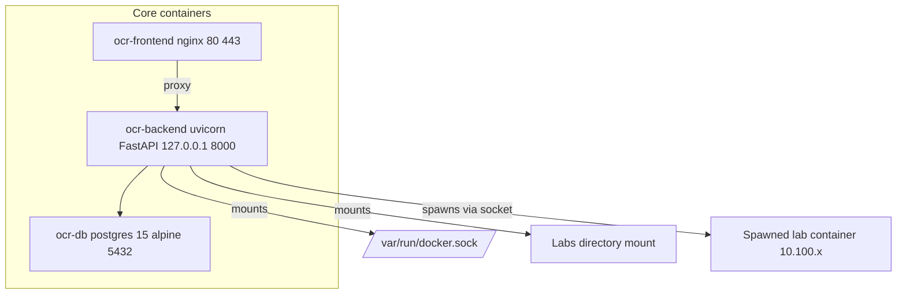
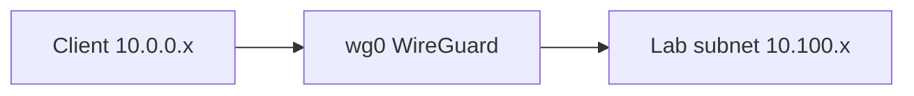
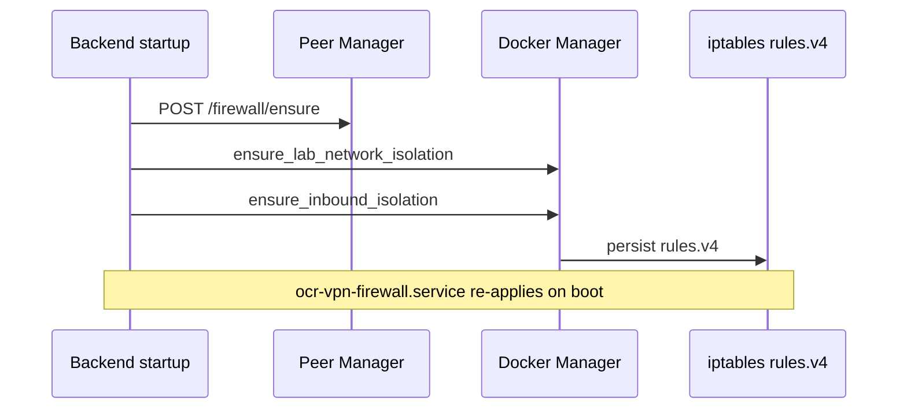
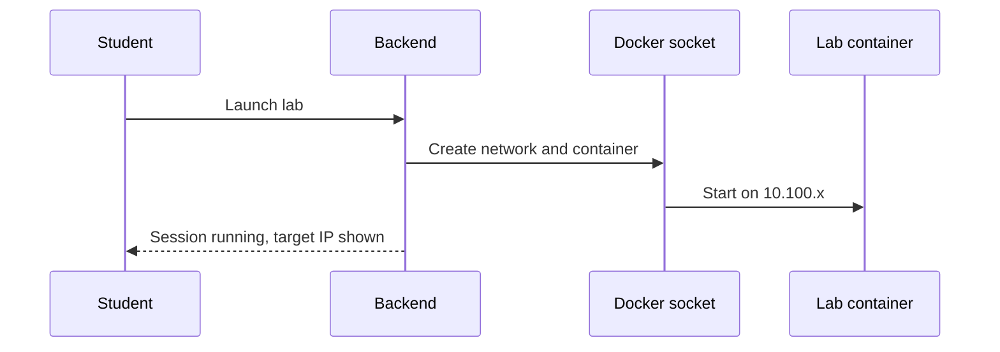
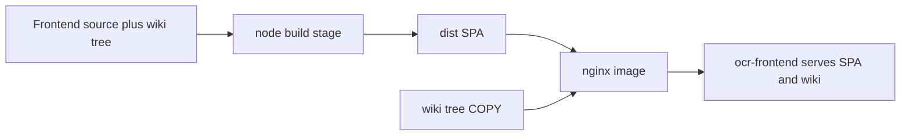
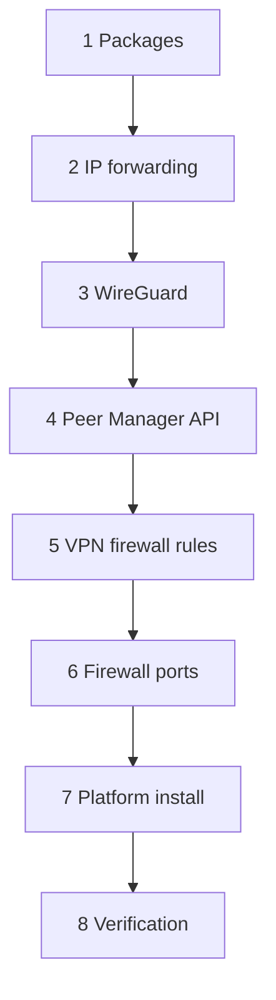

# Architecture

The architecture page describes how OpenCyberRange runs: the container stack, the network and IP scheme, the firewall model, lab spawning, and wiki delivery. Read it when you operate a range, debug an install, or plan capacity.

## Container stack

The platform runs three core containers defined in `docker-compose.yml`. The backend mounts the Docker socket so it can spawn lab containers on demand.

The diagram shows the core services, their ports, and the key mounts.

| Container | Image | Binding | Role |
|-----------|-------|---------|------|
| `ocr-frontend` | nginx | 80 and 443 | Serves the SPA and the baked-in wiki, proxies the API |
| `ocr-backend` | uvicorn / FastAPI | 127.0.0.1:8000 | API, lab orchestration, firewall apply |
| `ocr-db` | postgres:15-alpine | internal 5432 | PostgreSQL, `max_connections=300` |

The backend mounts the Docker socket, the labs directory, and the workbook skill.

!!! note "Worker count is dynamic"
    The backend computes its worker count as `(nproc * 2) + 1`, capped at 17. The count is not fixed, so a larger host runs more workers.

!!! warning "In-memory state is not shared across workers"
    With multiple workers running, a Python dictionary held at module level in one worker is invisible to the others. A value written on one request can read back empty on the next. Any state that must survive across requests uses file-based storage under `/tmp`, not a module-level variable. Keep this in mind when you debug intermittent empty responses.

## Network and IP scheme

Student VPN clients live on `10.0.0.x`. Lab networks live under `10.100.0.0/16`, one `10.100.x` subnet per user session.

The diagram shows a client crossing the VPN to reach its lab subnet.

| Range | Purpose |
|-------|---------|
| `10.0.0.x` | VPN clients (WireGuard) |
| `10.100.0.0/16` | Lab networks, one `10.100.x` subnet per session |

## Firewall model

The firewall isolates the OCR subnets from external interfaces while leaving published ports reachable. `DOCKER-USER` DROP rules block external interfaces from reaching the OCR subnets. Published ports are unaffected because DNAT in `PREROUTING` runs before the `FORWARD` chain.

The rules apply automatically when the backend starts. The diagram shows the startup sequence.

Because the rules apply on backend start, a reboot self-heals the firewall with no manual step. The rules also persist to `/etc/iptables/rules.v4` and re-apply through `ocr-vpn-firewall.service`. See [How Prerequisite Unlocking Works](../06_Lab_Workflow_Reference/02_How_Prerequisite_Unlocking_Works.md) for related lab-access behavior and [Cannot Reach Lab Target](../07_Troubleshooting/05_Cannot_Reach_Lab_Target.md) for isolation symptoms.

## Lab spawn flow

When a student launches a lab, the backend uses the Docker socket to create a per-session container on a fresh `10.100.x` subnet.

For the full session lifecycle see [Lab Lifecycle Overview](../06_Lab_Workflow_Reference/01_Lab_Lifecycle_Overview.md).

## Wiki delivery

Wiki content is baked into the frontend image at build time. The frontend Dockerfile is a multi-stage build: a node stage builds the SPA, then the nginx stage copies the built site and the `wiki/` tree into `/usr/share/nginx/wiki/`. The namespaced tree holds `range/`, `course/`, `reference/`, and `index.html`.

!!! warning "Do not docker cp wiki content"
    Wiki content ships by image bake-in. Copying files into the running container with `docker cp` is lost on the next container recreation. To change wiki content, rebuild the frontend image and bring it up.

## Install phase sequence

The full-server installer runs eight phases in order. The diagram shows the sequence.

## Security model

An impersonation read-only middleware enforces that an admin viewing a student account cannot mutate data: it returns 403 for POST, PUT, DELETE, and PATCH while impersonating, whitelisting only the impersonate, exit, and change-password actions. The admin view is observe-only.

## Schema changes

The platform has no migration framework. Schema changes are applied as manual `ALTER TABLE` statements against the running database.

!!! warning "Plan schema changes by hand"
    When an update adds a column, you run the matching `ALTER TABLE` yourself. The application does not migrate the schema on start, so a missing column surfaces as a runtime error rather than an auto-applied change.
