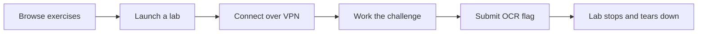
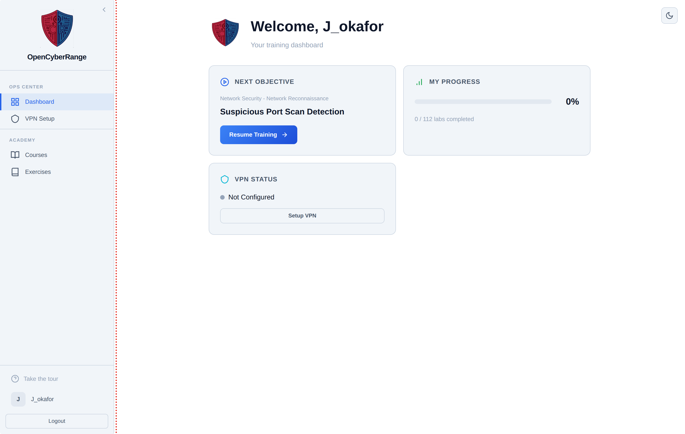
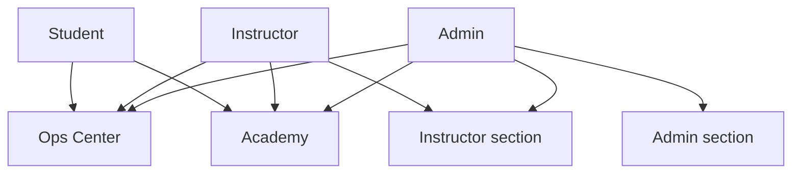

# Platform Overview

OpenCyberRange is a browser-based platform for running hands-on cybersecurity labs. You launch an isolated lab environment, connect to it over a private VPN, solve a challenge, and submit a flag to prove you finished. Read this page when you want to understand which role you hold and which parts of the platform you can reach.

## Who uses the platform

The platform has three roles. Your role decides which sidebar sections you see and which actions you can take.

| Role | What you do | Where you spend most time |
| --- | --- | --- |
| Student | Launch labs, connect over VPN, submit flags, track progress, join courses | Exercises, Courses, VPN Setup |
| Instructor | Manage your own courses, share invite codes, monitor students, generate reports | Instructor section, your course pages |
| Admin | Approve accounts, manage users and exercises, configure the platform, run monitoring | Admin section |

An admin creates the first account during setup and approves every account that registers afterward. See [First-Time Setup](03_First_Time_Setup.md) and [Registering an Account](04_Registering_an_Account.md).

## How a lab works

You browse a catalog of exercises, launch one, and the platform builds a private network of containers for you. You reach the lab targets over a WireGuard VPN, work the challenge from your own machine or from the in-browser RangeBox, and submit a flag in the format `OCR{...}`. A correct flag stops and tears down the lab automatically. Only one lab session runs at a time.

The diagram below shows the path from browsing to a finished lab.

For the full sequence and timing rules, see [Lab Lifecycle Overview](../06_Lab_Workflow_Reference/01_Lab_Lifecycle_Overview.md) and [Time Limits and Expiration](../06_Lab_Workflow_Reference/05_Time_Limits_and_Expiration.md).

## The interface at a glance

The interface is a left sidebar plus a main content area. There is no top navigation bar. The sidebar groups its links into sections, and you only see the sections your role allows.

<figure markdown>

<figcaption>The left sidebar carries all navigation; the main area shows the active view.</figcaption>
</figure>

The sidebar sections and the roles that see them:

Ops Center and Academy are visible to everyone. The Instructor section appears for instructors and admins. The Admin section appears for admins only. Team Challenges items appear only when an admin enables the matching module, so they may be absent in your deployment.

For a guided tour of every sidebar item, see [Navigating the Interface](06_Navigating_the_Interface.md).

## VPN and RangeBox

Lab targets live on private networks you cannot reach directly. You have two ways in:

- Install a WireGuard client on your own machine and import your config. See [VPN Overview](../05_VPN_Setup_Guide/01_VPN_Overview.md).
- Use RangeBox, an in-browser desktop that already sits on the lab network, so no client install is needed.

!!! tip
    If you cannot install software on your machine, RangeBox lets you work a lab from any browser without setting up WireGuard.

## What comes next

- Confirm your machine can run the platform: [System Requirements](02_System_Requirements.md).
- Create your account: [Registering an Account](04_Registering_an_Account.md).
- Sign in: [Logging In](05_Logging_In.md).
