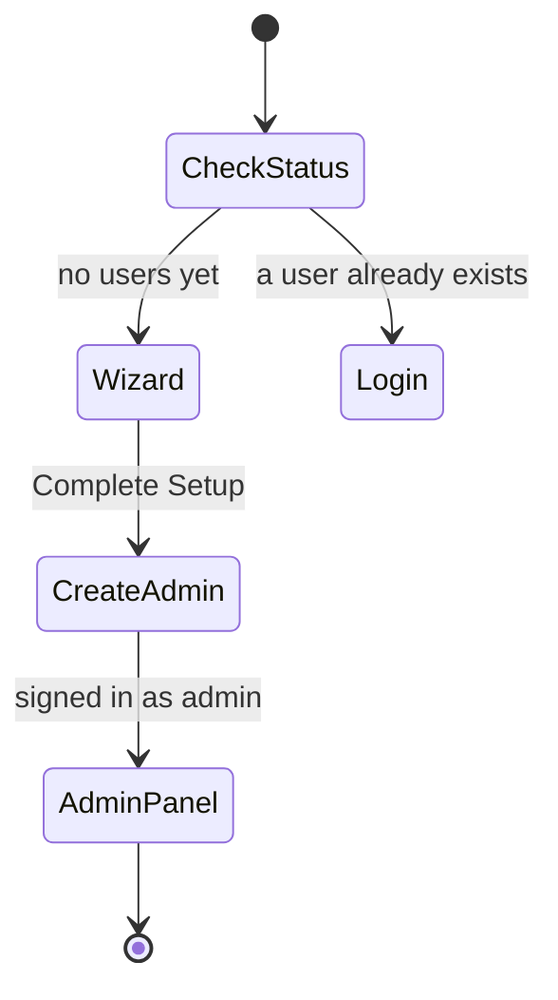

# First-Time Setup

The first-run Setup Wizard creates the first admin account and seeds the platform defaults. You complete it once, immediately after the platform is installed and before anyone can register or log in. Read this page if you are the person standing up a fresh instance.

## Prerequisites

- A deployed, running platform. See [Local Deployment](../00_Server_Deployment/02_Local_Deployment.md) or [Cloud Deployment](../00_Server_Deployment/03_Cloud_Deployment.md).
- A browser that can reach the platform address over HTTPS.

## When the wizard appears

Open the platform in your browser. While no user account exists yet, the platform sends you to the Setup Wizard at `/setup`. Once any user exists, the wizard is closed: opening `/setup` sends you to the login page instead. The wizard runs exactly once per instance.

## Steps

The wizard walks through four steps. Move forward with **Next** and back with **Back**.

1. **Account.** Enter the admin **Username**, **Email**, **Password**, and **Confirm Password**, and the **Setup token** the installer printed at the end of the install (it is also in the server's `.env` as `SETUP_TOKEN`). Then click **Next**. The username must be at least 3 characters, the email must be valid and use a real, routable domain such as `example.com` (an internal-only suffix like `.local` passes this step but is rejected when you click **Complete Setup**), and the password must be at least 8 characters with an uppercase letter, a lowercase letter, and a digit. The two password fields must match.
2. **Security.** Leave **Require Admin Approval** on (the default) so that every account that registers waits for your approval before it can log in, then click **Next**.
3. **Modules.** Turn on any optional modules you want available, then click **Next**. The toggles default to off, and you can change them later in the Admin Settings, so you can safely leave them off for now.
4. **Review & Complete.** Check the summary grid, then click **Complete Setup**.

**What you should see:** the platform creates your admin account, signs you in, and opens the Admin panel.

!!! note
    The Setup Wizard cannot be reached after the first account exists. If you open `/setup` on a running platform, you land on the login page. There is no way to re-run the wizard; later changes happen in the Admin Settings.

!!! warning
    Choose the admin credentials carefully. The wizard creates the only account that exists at first, and that admin approves everyone else. Store the password somewhere safe.

## After setup

You are signed in as admin. Next steps:

- Tell students how to register: [Registering an Account](04_Registering_an_Account.md).
- Approve the accounts that come in (see your Admin guide).
- Confirm the install is healthy: [Post Installation](../00_Server_Deployment/04_Post_Installation.md).

If the wizard does not appear when you expect it, the platform already has a user; sign in at [Logging In](05_Logging_In.md), or see [Login Issues](../07_Troubleshooting/01_Login_Issues.md).
