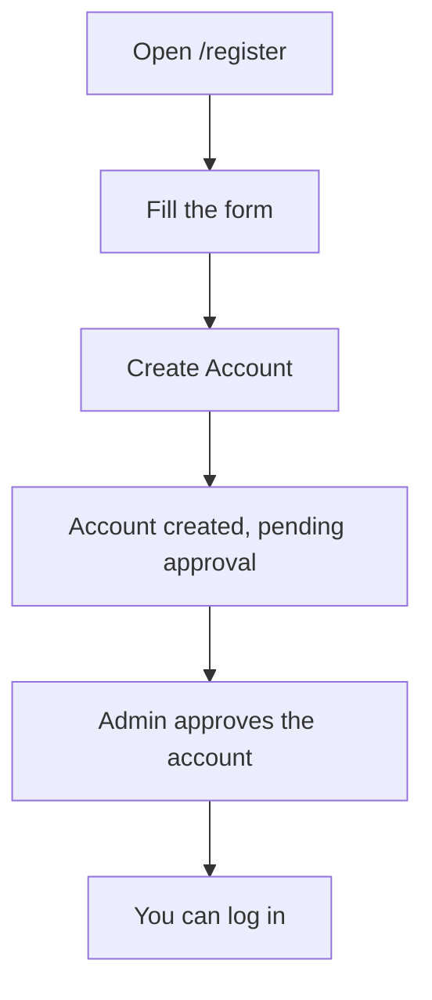
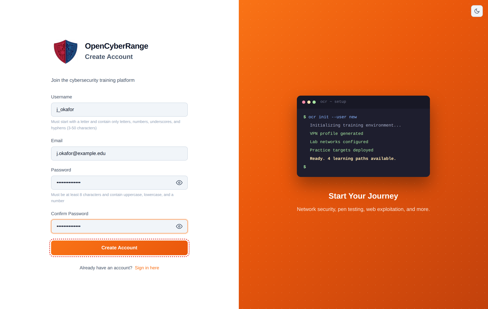

# Registering an Account

Registration creates your student account. You fill in a short form, the platform creates the account, and an admin approves it before you can log in. Read this page when you are signing up for the first time.

## Prerequisites

- A running platform you can reach in your browser. See [System Requirements](02_System_Requirements.md).
- An email address and a username you want to use.

## What registration involves

Registration is open: anyone who can reach the platform can submit the form. Every account is then held for admin approval before it can sign in. There is no invite code for the platform account, no email-verification step, and no second authentication factor.

## Steps

1. Go to the login page and click **Register here**, or open `/register` directly.
2. Enter your **Username**. It must start with a letter and may contain letters, numbers, underscores, and hyphens, between 3 and 50 characters.
3. Enter your **Email** address.
4. Enter a **Password**. The help text reads: must be at least 8 characters and contain uppercase, lowercase, and a number. The form checks each field as you leave it.
5. Re-enter the same password in **Confirm Password**.
6. Click **Create Account**.

**What you should see:** a success message that reads, "Account created successfully! Your account is pending administrator approval. You will be able to log in once approved." The page then sends you back to the login screen after a few seconds.

<figure markdown>

<figcaption>The registration form collects a username, email, and password; there is no invite code or verification step.</figcaption>
</figure>

## Approval (on by default)

By default a freshly registered account is held for approval until an admin approves it, and you cannot log in during that wait; no verification email is sent. An administrator can turn approval off in platform settings, in which case new accounts are approved automatically and can sign in immediately. If you are unsure which mode your instance uses, ask your administrator.

!!! note
    If you try to log in before an admin approves you, the platform tells you the account is not yet approved. Contact your instructor or admin if the wait is longer than expected.

!!! warning
    If your chosen username, email, or student ID already belongs to an account, the platform returns a single generic message: "An account with these credentials already exists." The message does not say which field collided, so try a different username and email.

## After you are approved

Once an admin approves your account, sign in: [Logging In](05_Logging_In.md). If your first sign-in fails, see [Login Issues](../07_Troubleshooting/01_Login_Issues.md).
