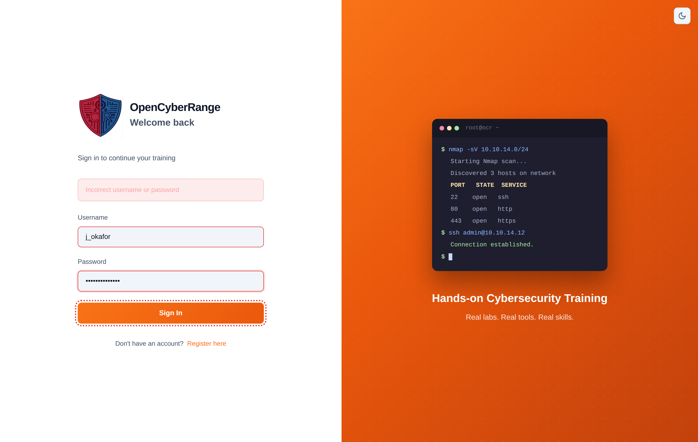
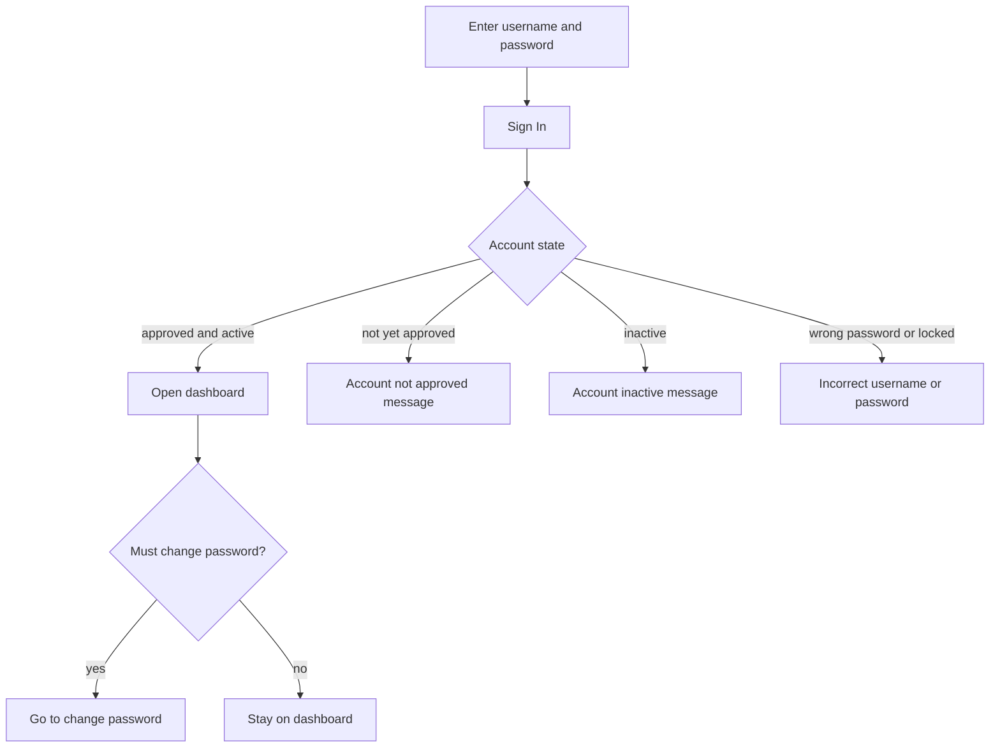

# Logging In

Logging in opens your session on the platform. You enter your username and password once, and the platform takes you to your dashboard. Read this page when you are signing in for the first time or troubleshooting a failed attempt.

## Prerequisites

- A registered account that an admin has approved. See [Registering an Account](04_Registering_an_Account.md).
- Your username and password.

## Steps

1. Open the login page at `/login`.
2. Enter your **Username**.
3. Enter your **Password**.
4. Click **Sign In**.

**What you should see:** the platform signs you in and opens your dashboard. Students land on the student dashboard; instructors and admins land on the instructor and admin dashboard.

<figure markdown>

<figcaption>The login screen takes a username and password; there is no second authentication step.</figcaption>
</figure>

## What happens when you sign in

Login is single factor: a username and a password, with no second step. The platform checks your credentials and then routes you based on your account state.

If your account is flagged to change its password on first sign-in, the platform sends you to the change-password screen before you reach the dashboard.

## When sign-in fails

| Message | What it means | What to do |
| --- | --- | --- |
| Incorrect username or password | The username or password is wrong, or the account is locked from too many failed attempts | Re-enter your credentials carefully. If it keeps failing, see [Account Locked](../07_Troubleshooting/02_Account_Locked.md). |
| User account not approved. Please wait for admin approval. | An admin has not approved your account yet | Wait for approval, then sign in. See [Registering an Account](04_Registering_an_Account.md). |
| User account is inactive | An admin has disabled your account | Contact your instructor or admin. |

!!! warning
    A locked account shows the same "Incorrect username or password" message as a simple typo. The platform does not announce a lockout, so if your correct password is being rejected repeatedly, treat it as a possible lockout and see [Account Locked](../07_Troubleshooting/02_Account_Locked.md).

!!! note
    Repeated rapid attempts are rate limited. If you submit too quickly, pause for a minute before trying again.

## After you sign in

Get oriented with the layout: [Navigating the Interface](06_Navigating_the_Interface.md). For more on failed sign-ins, see [Login Issues](../07_Troubleshooting/01_Login_Issues.md).
