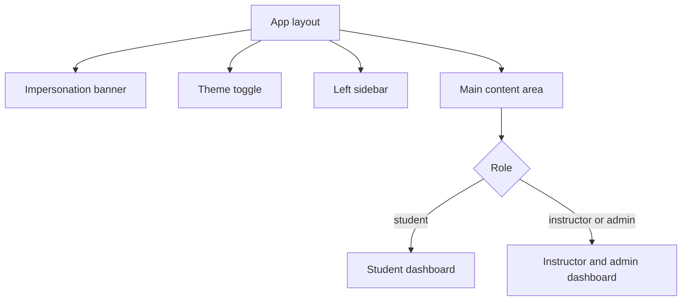

# Navigating the Interface

The interface is a left sidebar plus a main content area, and nearly everything you do starts from a sidebar link. Read this page after you sign in to learn what each section does and which links your role gives you.

## Prerequisites

- A signed-in session. See [Logging In](05_Logging_In.md).

## Layout

The platform places all navigation in a left sidebar. There is no top navigation bar. The only other global elements are a floating theme toggle in the top-right corner and, when an admin is viewing the platform as another user, an impersonation banner across the top.

<figure markdown>

<figcaption>The sidebar holds every navigation link; the main area renders the selected page.</figcaption>
</figure>

The diagram below shows how the layout fits together and where the dashboard splits by role.

## Sidebar sections

The sidebar groups links into sections. You see only the sections your role allows.

| Section | Links | Who sees it |
| --- | --- | --- |
| Ops Center | Dashboard, VPN Setup | Everyone |
| Academy | Courses, Exercises, and Activities when that module is enabled | Everyone |
| Team Challenges | Optional module links, each shown only when an admin enables that module | Everyone, when a module is enabled |
| Instructor | My Courses, Exercises | Instructors and admins |
| Admin | Users, Courses, Exercises, Monitoring, System, Settings, Workbook | Admins only |

Team Challenges links are conditional. The platform shows a Team Challenges link only when an admin has turned on the matching module, so the section may be empty or absent in your deployment.

## Footer controls

At the bottom of the sidebar you find:

- **Profile**, which opens your profile page.
- **Logout**, which ends your session.
- **Privacy Mode** (instructors and admins only), a toggle that masks student names across the views you see.

## Collapsing the sidebar

Use the chevron button at the top of the sidebar to collapse it to a narrow strip and expand it again. Collapsing frees up horizontal space for lab consoles and wide tables.

!!! tip
    Collapse the sidebar with the chevron while you work inside a lab console so the console has more room.

!!! note
    The Admin "Workbook" link opens the workbook wiki in a new browser tab. The other links navigate within the same tab.

## Where to go next

- Students: start at [Browsing Exercises](../02_Student_Guide/02_Browsing_Exercises.md) or [Student Dashboard](../02_Student_Guide/01_Student_Dashboard.md).
- Instructors: start at [Instructor Dashboard](../03_Instructor_Guide/01_Instructor_Dashboard.md).
- Set up lab access first: [VPN Overview](../05_VPN_Setup_Guide/01_VPN_Overview.md).
