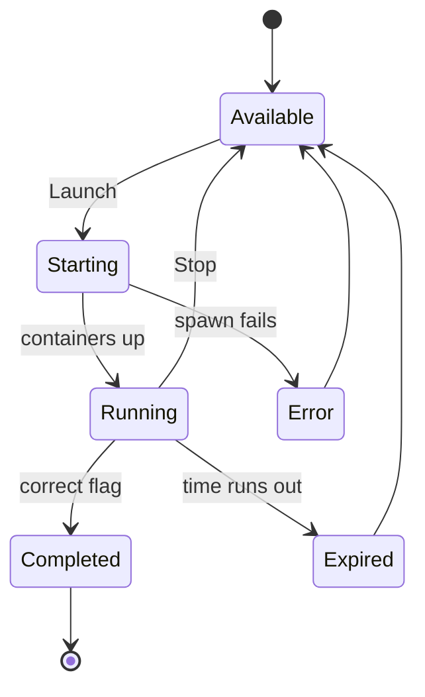

# Student Dashboard

The dashboard is your landing page after you log in. The page tells you what to work on next, how far you have come, whether your VPN is ready, and where you stand in your course. Open it any time you want a quick read on your training before you start an exercise.

## Prerequisites

- A platform account that an admin has approved. See [Registering an Account](../01_Getting_Started/04_Registering_an_Account.md).
- A successful login. See [Logging In](../01_Getting_Started/05_Logging_In.md).

## What the dashboard shows

After login the platform routes you to `/dashboard` and renders the student view. The header greets you with "Welcome, {your username}". Below it sit up to four cards.

<figure markdown>

<figcaption>The student dashboard shows your next objective, overall progress, VPN status, and your course rank.</figcaption>
</figure>

| Card | What it tells you | Action on the card |
|------|-------------------|--------------------|
| Next Objective | The track, level, and lab name the platform suggests next. Shows "All labs completed#" when nothing is left. | Resume Training, which opens the Exercises hub |
| My Progress | A progress bar plus "X / Y labs completed" across the labs available to you | None |
| VPN Status | A status dot reading "Registered" or "Not Configured", and your assigned client IP when present | Download Config or Setup VPN, which opens the VPN setup page |
| Your Rank | "#N in {course name}", your place on a course scoreboard | None |

## Move from the dashboard into training

1. Read the **Next Objective** card to see the suggested track, level, and lab.
2. Click **Resume Training**. The platform opens the Exercises hub at `/exercises`.
3. From the hub, pick a track and open the lab you want. See [Browsing Exercises](02_Browsing_Exercises.md).

**What you should see:** the Exercises hub loads with your track cards and their progress bars.

## When cards do not appear

!!! note "The Rank card is conditional"
    The **Your Rank** card appears only when you are enrolled in an active course that has assigned labs. If you have not joined a course, or your course has no labs assigned yet, the card stays hidden. See [Joining a Course](12_Joining_a_Course.md).

!!! tip "Set up your VPN early"
    A fresh account shows "Not Configured" on the VPN card with a **Setup VPN** button. Lab targets sit on isolated subnets that you reach only through the tunnel, so download your config before your first lab. See [Connecting via VPN](05_Connecting_via_VPN.md).

The **My Progress** bar counts only labs that are active and visible to you. Solving a flag is what advances it; opening or stopping a lab does not. See [Tracking Your Progress](11_Tracking_Your_Progress.md).

## How a lab session moves through its life

Your dashboard and the lab panel both reflect the same session lifecycle. The diagram below shows the states a lab session passes through from launch to completion.

A correct flag moves the session to Completed and tears down the environment. A stop returns the lab to Available without marking it complete. See [Lab Statuses Explained](../06_Lab_Workflow_Reference/06_Lab_Statuses_Explained.md).

If the dashboard does not load or your login fails, see [Login Issues](../07_Troubleshooting/01_Login_Issues.md).
