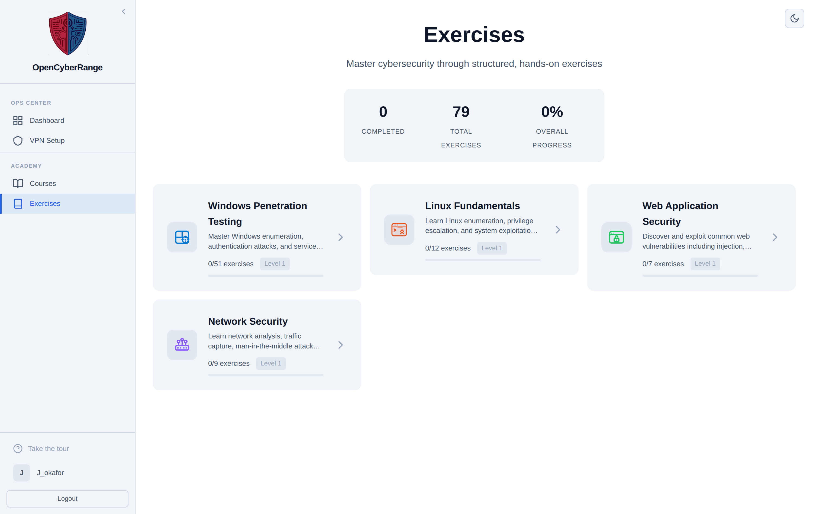

# Browsing Exercises

The Exercises hub is where you find every training path open to you. The page groups labs into tracks, shows your progress in each, and lets you open a track to see its levels and labs. Start here whenever you want to choose what to work on.

## Prerequisites

- A logged-in, approved account. See [Logging In](../01_Getting_Started/05_Logging_In.md).

## Open the hub

The hub lives at `/exercises`. You reach it from the **Exercises** item in the left sidebar, from the **Resume Training** button on your dashboard, or by typing the address directly. The platform redirects the older `/labs` and `/curriculum` addresses here, so any old bookmark still lands you on the same page.

<figure markdown>

<figcaption>The Exercises hub lists your tracks as cards, each with a progress bar and exercise count.</figcaption>
</figure>

The page opens with the title "Exercises" and a three-stat **Overall Progress** summary: labs Completed, Total Exercises, and Overall Progress percent. Below the summary sits a grid of track cards.

Each track card shows:

- An icon and the track name.
- A short description of the track.
- An "X/Y exercises" count.
- A "Level N" chip marking your current level in that track.
- A progress bar, and a green "Complete" badge once you finish the track.

## Choose a track and open it

1. Open `/exercises` from the sidebar.
2. Scan the track cards and read the descriptions to pick a path.
3. Click a track card. The platform opens that track at `/exercises/<slug>`, where the levels and labs appear.

**What you should see:** the track page loads with its levels listed as an accordion and the labs inside each level. See [Understanding Tracks, Levels, and Labs](03_Understanding_Tracks_Levels_and_Labs.md).

## When the hub looks empty or different

!!! note "Empty state"
    If no active tracks are published, the hub shows "No learning paths available yet". Check back later or ask your instructor.

!!! tip "Deep links open the right track"
    A link that carries a lab, course, or wiki reference resolves automatically and drops you into the matching track. Instructors and the dashboard use these links so you do not have to hunt for a lab by hand.

Reordering handles on the track cards belong to instructors and admins only. As a student you never see them, and the card order is fixed for you.

If a track you expect is missing, the labs in it may be reserved for a course you have not joined. See [Course Labs and Assignments](13_Course_Labs_and_Assignments.md).
