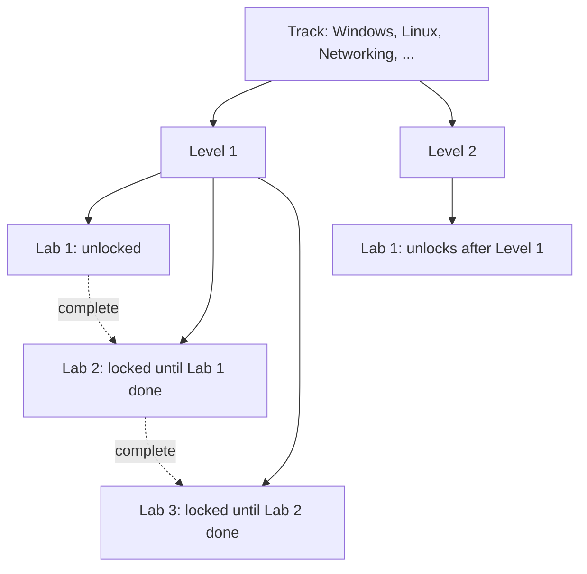
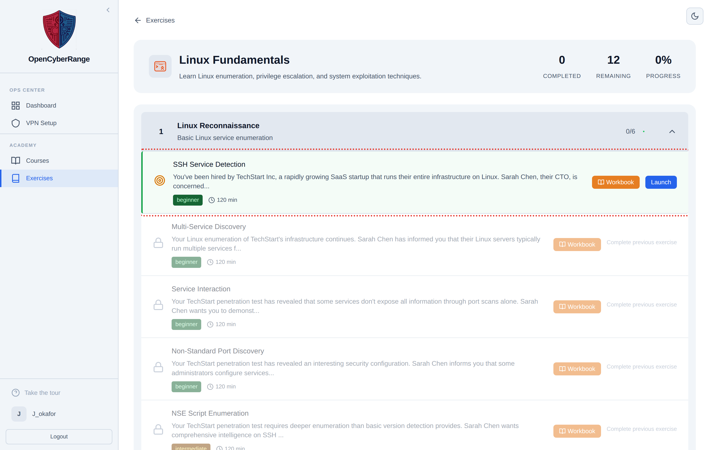

# Understanding Tracks, Levels, and Labs

The platform organizes every exercise into three tiers: tracks, levels, and labs. Knowing how the three fit together explains why some labs are open while others stay locked, and how your progress moves you forward. Read this page once and the rest of the Student Guide makes more sense.

## Prerequisites

- Familiarity with the Exercises hub. See [Browsing Exercises](02_Browsing_Exercises.md).

## The three tiers

A **track** is a full subject path, such as Windows, Linux, Networking, Bean & Byte, or Network Security. Each track has its own color and icon and contains an ordered set of levels.

A **level** is a stage inside a track, numbered in order. Each level holds an ordered set of labs and reports its own completion count.

A **lab** is a single exercise: an environment you launch, work in, and finish by submitting a flag. Each lab carries a difficulty, an estimated duration, the tools it expects, and an optional workbook.

The diagram below shows the hierarchy and where sequential locking applies.

## How labs unlock

Labs unlock in order. A lab stays locked until you complete the lab before it. A locked row shows "Complete previous exercise" and is not clickable. Completing a lab means submitting its correct flag; opening or stopping a lab does not unlock the next one. See [How Prerequisite Unlocking Works](../06_Lab_Workflow_Reference/02_How_Prerequisite_Unlocking_Works.md).

The "Level N" chip on a track card and the per-level completion rings on the track page tell you where you are in the sequence.

<figure markdown>

<figcaption>A track page lists its levels with completion rings; expanding a level shows its lab rows, each with a Launch button when unlocked.</figcaption>
</figure>

## What you see on a lab row

| Element | Meaning |
|---------|---------|
| Lab name and scenario brief | The exercise title and a one-line setup |
| Difficulty | The expected skill level |
| Duration | The estimated time to finish |
| Tools | The main tools the lab expects you to use |
| Drill badge (blue) | A short command drill rather than a full scenario |
| Launch button | The lab is unlocked and ready to start |
| "Complete previous exercise" | The lab is locked behind an earlier one |

Drill labs are short, focused command exercises. They carry a blue "Drill" badge and often show their target IPs directly so you can practice commands without first discovering hosts.

## Labs you will not see in the main list

!!! note "Course-only labs"
    Some labs are reserved for a specific course. Course-only labs do not appear in the main track list. You reach them only inside the course your instructor assigned them to. See [Course Labs and Assignments](13_Course_Labs_and_Assignments.md).

To start a lab once you understand the model, see [Launching a Lab](04_Launching_a_Lab.md).
