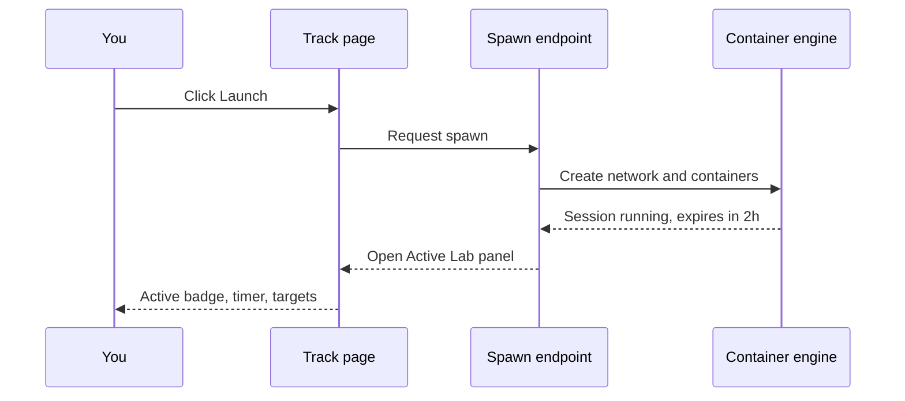

# Launching a Lab

Launching a lab spins up its environment and opens the Active Lab panel, where you work, submit your flag, and manage the session. You do this every time you start a new exercise.

## Prerequisites

- An unlocked lab on a track page. See [Understanding Tracks, Levels, and Labs](03_Understanding_Tracks_Levels_and_Labs.md).
- Your VPN configured if you plan to connect from your own machine. See [Connecting via VPN](05_Connecting_via_VPN.md).

## Start an exercise

1. Open the track at `/exercises/<slug>` and expand the level that holds your lab.
2. Find an unlocked lab that you have not completed. Its row shows a **Launch** button.
3. Click **Launch**. The platform calls the spawn endpoint and opens the Active Lab panel. While the environment comes up, the panel button reads **Starting...**.
4. Wait for the panel to show the "Active" badge, a countdown timer, and the Exercise Network section.

You can also open the panel first and press **Start Exercise** inside it; both routes do the same thing.

<figure markdown>

<figcaption>The track page lists labs by level; unlocked labs show a Launch button that opens the Active Lab panel.</figcaption>
</figure>

**What you should see:** the Active Lab panel shows an "Active" badge, a running timer, and the Exercise Network with your subnet or target IPs. Your session runs for two hours by default. See [Working Inside a Lab](06_Working_Inside_a_Lab.md).

## What happens when you launch

The diagram below shows the order of events from your click to a running session.

## One session at a time

!!! warning "You can run only one lab session"
    The platform allows a single active session per account. If you try to launch a second lab while one is running, the platform refuses with "You already have an active lab session. Please stop it first." The Launch buttons on other labs are disabled until you stop the current one. See [Stopping a Lab](10_Stopping_a_Lab.md).

!!! note "Launch gives you targets, not an attacker host"
    A launch starts the lab targets. It does not hand you a machine to attack from unless you request the in-browser RangeBox desktop. You either connect from your own machine over the VPN or launch RangeBox. See [Working Inside a Lab](06_Working_Inside_a_Lab.md).

If the panel shows an error state or the lab never reaches "Active", see [Lab Fails to Start](../07_Troubleshooting/03_Lab_Fails_to_Start.md).
