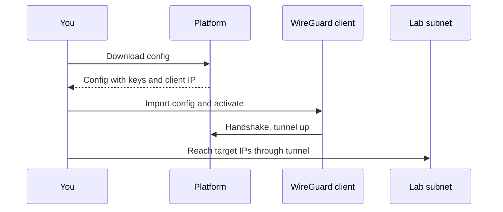

# Connecting via VPN

Lab targets live on isolated subnets with no path in from the public internet. A WireGuard VPN tunnel is how you reach them from your own machine. Set the tunnel up once, and you connect to any lab you launch. The full platform-wide VPN guide covers each operating system in detail; this page is the student-side summary.

## Prerequisites

- A logged-in, approved account. See [Logging In](../01_Getting_Started/05_Logging_In.md).
- A WireGuard client installed for your operating system. See the [VPN Setup Guide](../05_VPN_Setup_Guide/01_VPN_Overview.md).

## Download your VPN config

1. Open the VPN setup page at `/vpn-setup`, or click **Setup VPN** or **Download Config** on your dashboard VPN card.
2. Download your WireGuard configuration file.
3. Import the file into your WireGuard client and activate the tunnel.
4. Launch a lab and connect to its target IPs.

<figure markdown>

<figcaption>The VPN setup page provides your WireGuard configuration download and connection details.</figcaption>
</figure>

The first time you download your config, the platform generates a key pair, assigns you a client IP, and registers you as a peer. After that, your VPN card on the dashboard reads "Registered" and shows your client IP.

**What you should see:** after you activate the tunnel, your WireGuard client reports a handshake, and you can reach the target IPs listed in the Exercise Network section of a running lab.

## How the connection works

The diagram below shows the path from downloading your config to reaching a lab target.

Your config routes the lab subnets through the tunnel. The table below lists the address ranges it carries.

| Routed range | Purpose |
|--------------|---------|
| 10.100.0.0/14 | Lab target networks |
| 10.104.0.0/13 | Lab target networks |
| 10.112.0.0/12 | Lab target networks |
| 10.128.0.0/9 | Lab target networks |

The platform web interface is not one of these ranges: you reach it over HTTPS at the server address, not through the tunnel. The standalone RangeBox pool (10.50.0.0/16) is deliberately left off so the tunnel never overrides that range on your own network.

## When the tunnel does not connect

!!! note "RangeBox needs no VPN"
    If you use the in-browser RangeBox desktop, you work from a machine already on the lab network and do not need the VPN at all. See [Working Inside a Lab](06_Working_Inside_a_Lab.md).

!!! warning "Targets are isolated"
    Lab subnets have no internet access. The tunnel is the only way in from your own machine. If a target seems unreachable, confirm the tunnel is active and your handshake is recent. See [Testing Your Connection](../05_VPN_Setup_Guide/07_Testing_Your_Connection.md).

If your download succeeds but you still cannot reach a target, see [VPN Connection Problems](../07_Troubleshooting/04_VPN_Connection_Problems.md) and [Cannot Reach Lab Target](../07_Troubleshooting/05_Cannot_Reach_Lab_Target.md).
