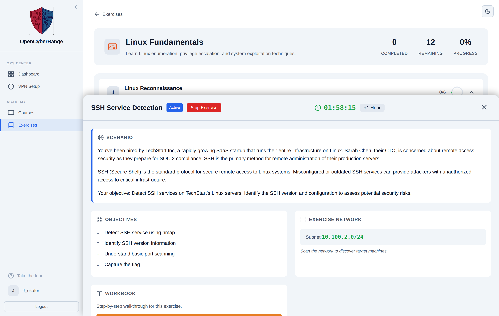
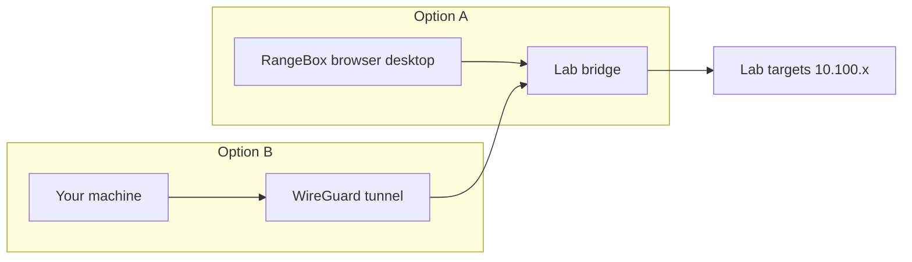

# Working Inside a Lab

The Active Lab panel is the single screen that hosts everything you do during an exercise: the scenario, your objectives, the network and target details, the workbook link, the flag form, hints, and the session timer. Once a lab is running, you spend your time here.

## Prerequisites

- A running lab. See [Launching a Lab](04_Launching_a_Lab.md).
- A way to reach the targets: either the VPN tunnel or the in-browser RangeBox desktop. See [Connecting via VPN](05_Connecting_via_VPN.md).

## What the panel contains

The Active Lab panel slides up on the track page. From top to bottom it shows:

- **Scenario:** the situation and goal, rendered from the lab's brief.
- **Objectives:** the list of things to accomplish.
- **Exercise Network:** the subnet for the lab, plus a "Your targets:" list of per-node IPs when the lab provides them. When it does not, the section reads "Scan the network to discover target machines."
- **Target Hostnames:** a snippet you can add to your `/etc/hosts` file.
- **Open Workbook:** a button that opens the lab's workbook in a new tab.
- **Submit Flag:** the form where you enter your answer. See [Submitting Flags](07_Submitting_Flags.md).
- **Hints:** time-gated help. See [Using Hints](08_Using_Hints.md).
- A countdown timer and a **+1 Hour** button. See [Extending a Lab Session](09_Extending_a_Lab_Session.md).

<figure markdown>

<figcaption>The Active Lab panel hosts the scenario, network details, workbook link, flag form, and hints for the running lab.</figcaption>
</figure>

## Reach the targets two ways

You attack the same lab targets from one of two starting points. The diagram below shows both.

**RangeBox** is a Kali or Ubuntu desktop that runs in your browser, already on the lab network. Launch it from the panel and it opens in a dedicated tab. Its toolbar offers Reconnect, Clipboard send and get, Minimize, and Fullscreen. You need no VPN for RangeBox.

**Your own machine** reaches the same targets over the WireGuard tunnel. Use this when you prefer your local tools.

## Steps to start working

1. Read the **Scenario** and **Objectives** at the top of the panel.
2. Note the target IPs in **Exercise Network**, or plan to scan the subnet if no IPs are listed.
3. Connect: launch RangeBox from the panel, or activate your VPN tunnel.
4. Open the workbook with **Open Workbook** for guided steps when one is provided.
5. Work toward the objectives, then submit your flag.

**What you should see:** target IPs in the Exercise Network section, or a prompt to scan the network, and a reachable target once your connection is up.

## When something looks off

!!! note "Per-node IPs only appear for some labs"
    Target IPs in "Your targets:" show only when the lab is built to expose them. Other labs ask you to scan the subnet to find hosts. Both are normal.

If a target will not respond, see [Cannot Reach Lab Target](../07_Troubleshooting/05_Cannot_Reach_Lab_Target.md).
