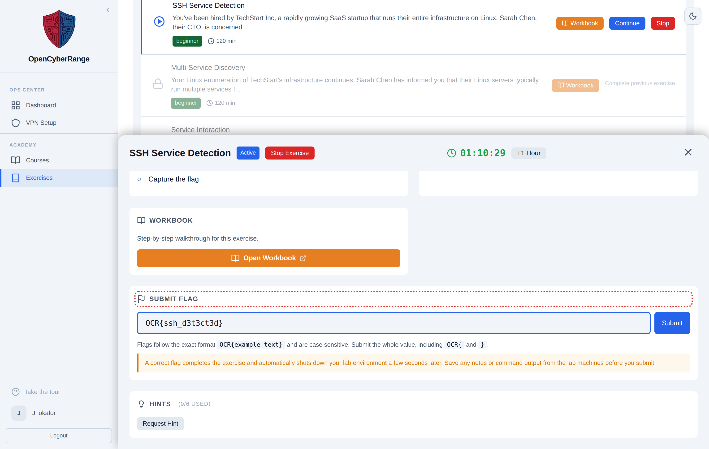
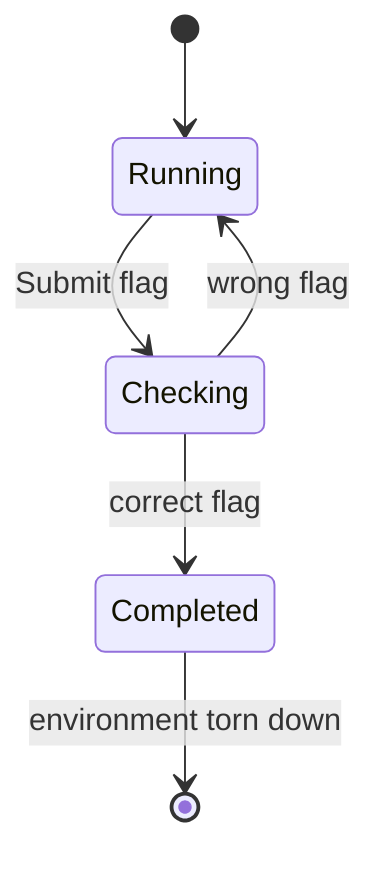

# Submitting Flags

Submitting the correct flag is how you complete a lab. The Submit Flag form sits in the Active Lab panel. A correct answer marks the lab complete and tears the environment down, so submit only when you are ready to finish.

## Prerequisites

- A running lab and a flag you have recovered. See [Working Inside a Lab](06_Working_Inside_a_Lab.md).

## Submit a flag

1. In the Active Lab panel, find the **Submit Flag** form. The input shows the placeholder `OCR{your_flag_here}`.
2. Paste your flag exactly as you found it.
3. Click **Submit**, or press Enter. While the platform checks, the button reads "Checking...".
4. Read the result message below the form.

<figure markdown>

<figcaption>The Submit Flag form is part of the Active Lab panel, below the scenario and network details.</figcaption>
</figure>

**What you should see:** a green success message on a correct flag, then the panel closes itself after a couple of seconds as the environment is torn down. A wrong flag shows a red message and the lab keeps running.

## Flag format and matching rules

The platform matches flags exactly. Keep these rules in mind.

| Rule | Detail |
|------|--------|
| Format | A flag looks like `OCR{...}` where the inside is lowercase letters, digits, and underscores |
| Case | Matching is case-sensitive; type the flag exactly as found |
| Whitespace | Leading and trailing spaces are trimmed for you |
| Rate limit | About 10 submissions per minute per lab |
| Cooldown message | "Too many attempts. Please wait 60 seconds." when you submit too fast |
| Already complete | Resubmitting a finished lab returns "You have already completed this lab#" |

## What a correct flag does

The diagram below highlights the transition a correct flag triggers.

## Read these before you submit

!!! warning "A correct flag destroys your environment"
    Submitting the correct flag auto-stops the lab and tears the environment down. You lose any shell, files, or notes left inside the lab. Save anything you need before you submit.

!!! note "Stopping is not completing"
    Only a correct flag marks a lab complete and unlocks the next one. Stopping a lab ends the session without credit. See [Stopping a Lab](10_Stopping_a_Lab.md).

If a flag you believe is correct is rejected, check the format and case first, then see [Flag Not Accepted](../07_Troubleshooting/06_Flag_Not_Accepted.md). For the full rules, see [Flag Format and Submission Rules](../06_Lab_Workflow_Reference/03_Flag_Format_and_Submission_Rules.md).
