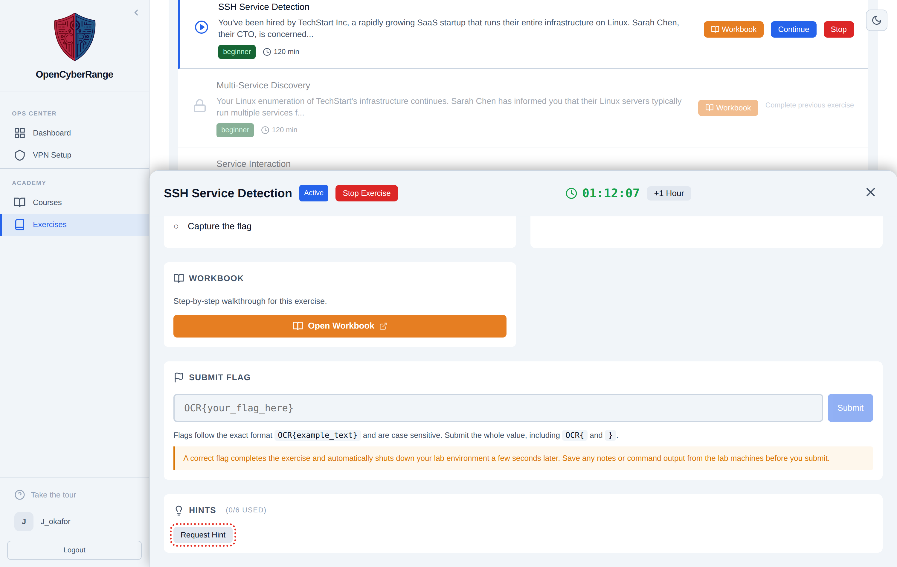

# Using Hints

Hints give you graduated help when you are stuck. The Hints section sits in the Active Lab panel. Hints unlock on a timer tied to when your lab started, and requesting one carries a cost to your score and achievements, so use them when you have genuinely stalled.

## Prerequisites

- A running lab. See [Working Inside a Lab](06_Working_Inside_a_Lab.md).

## Request a hint

1. In the Active Lab panel, find the **Hints** section. Its header reads "Hints (X/Y used)".
2. Click **Request Hint**.
3. Read the revealed hint, or read the countdown if the next hint has not unlocked yet.
4. Wait for the timer when prompted, then request again.

<figure markdown>

<figcaption>The Hints section shows how many hints you have used and a Request Hint button.</figcaption>
</figure>

**What you should see:** a revealed hint rendered below the button, or a message such as "First hint unlocks in N minutes" with a countdown that disables the button until the next hint is available.

## How time gating works

Each hint has an unlock time measured from when your lab started. The platform releases a hint only after enough minutes have passed. Until then, the button shows a countdown and stays disabled. The clock starts on your first hint or flag interaction with the lab.

## The cost of a hint

Using a hint changes your scoring and the achievements you can earn. Weigh the table below before you request one.

| Outcome | Effect of using a hint |
|---------|------------------------|
| Self-Reliant achievement | Forfeited; this achievement requires solving with no hints |
| Course score | Lower; the no-hints bonus of 25 points is lost for that lab |
| Lab completion | Unaffected; you can still complete the lab |

## Notes and edge cases

!!! warning "A hint forfeits the no-hints reward"
    Requesting even one hint costs you the Self-Reliant achievement for that lab and the no-hints score bonus in a course. Try the workbook and your own enumeration first. See [Achievements and Badges](15_Achievements_and_Badges.md) and [Scoring System Explained](../06_Lab_Workflow_Reference/04_Scoring_System_Explained.md).

!!! note "Some labs have no hints"
    A lab without authored hints shows "No hints available for this exercise". Lean on the workbook and the scenario instead.

If the Request Hint button stays disabled longer than the countdown suggests, confirm your lab is still running. See [Lab Statuses Explained](../06_Lab_Workflow_Reference/06_Lab_Statuses_Explained.md).
