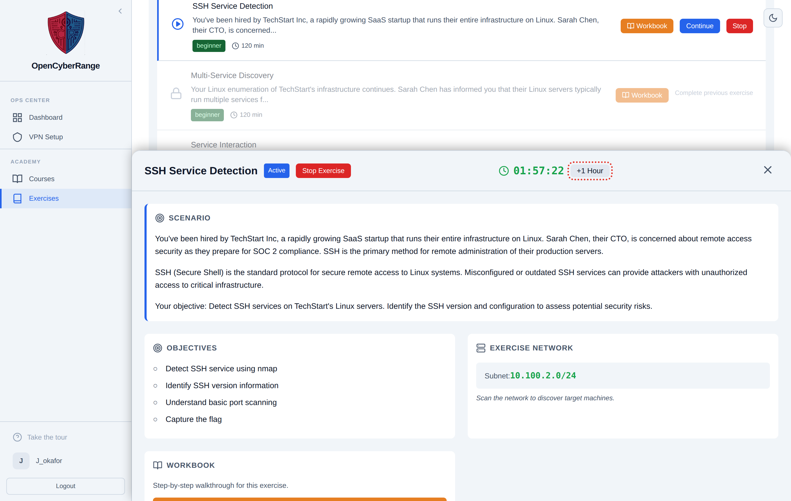

# Extending a Lab Session

A lab session runs for two hours by default. When you need more time, the **+1 Hour** button adds an hour to the clock. Extend before the timer reaches zero so your environment is not reclaimed mid-exercise.

## Prerequisites

- A running lab. See [Working Inside a Lab](06_Working_Inside_a_Lab.md).

## Add an hour

1. In the Active Lab panel, watch the countdown timer near the top. It shows the time left as `HH:MM:SS` and turns red under ten minutes.
2. Before the timer reaches zero, click **+1 Hour**. While the platform applies the extension, the button reads "Extending...".
3. Confirm the timer jumps forward by one hour.

<figure markdown>

<figcaption>The session timer and the +1 Hour button sit at the top of the Active Lab panel.</figcaption>
</figure>

**What you should see:** the countdown increases by one hour, and the warning color clears if you were under ten minutes.

## Notes and edge cases

!!! warning "Extend before the session expires"
    The platform extends only a session that is still running. Once a session expires, the environment is reclaimed and "+1 Hour" returns an error because there is no active session to extend. A background sweep reclaims expired sessions every couple of minutes, so do not count on a grace period after the timer hits zero. See [Time Limits and Expiration](../06_Lab_Workflow_Reference/05_Time_Limits_and_Expiration.md).

!!! note "Each click adds exactly one hour"
    Extension is a flat one-hour addition per click. To add more time, click **+1 Hour** again.

If your session expires before you can extend it, or expires sooner than expected, see [Session Expired Unexpectedly](../07_Troubleshooting/07_Session_Expired_Unexpectedly.md).
