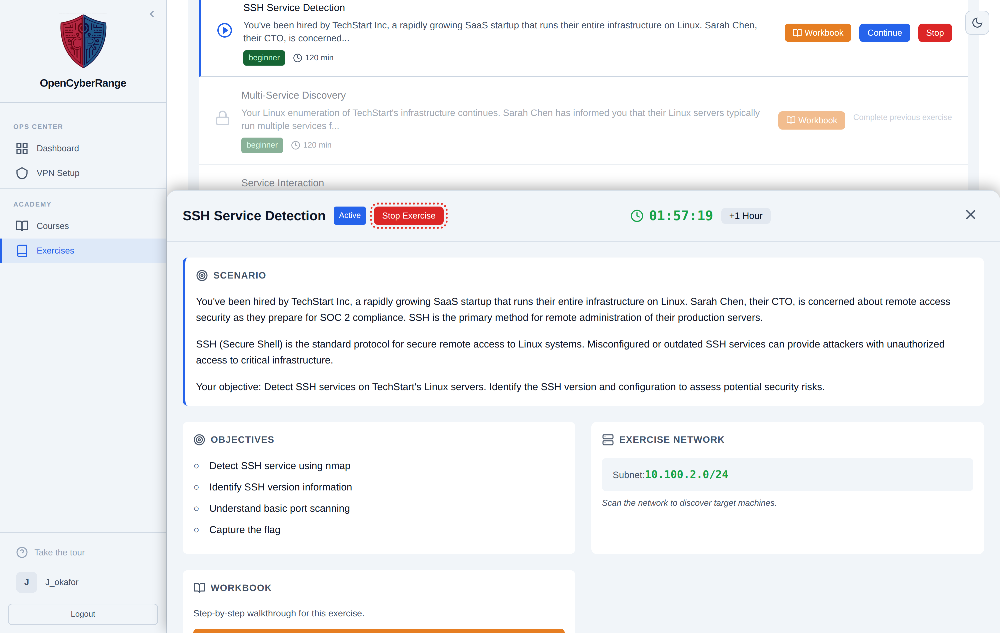
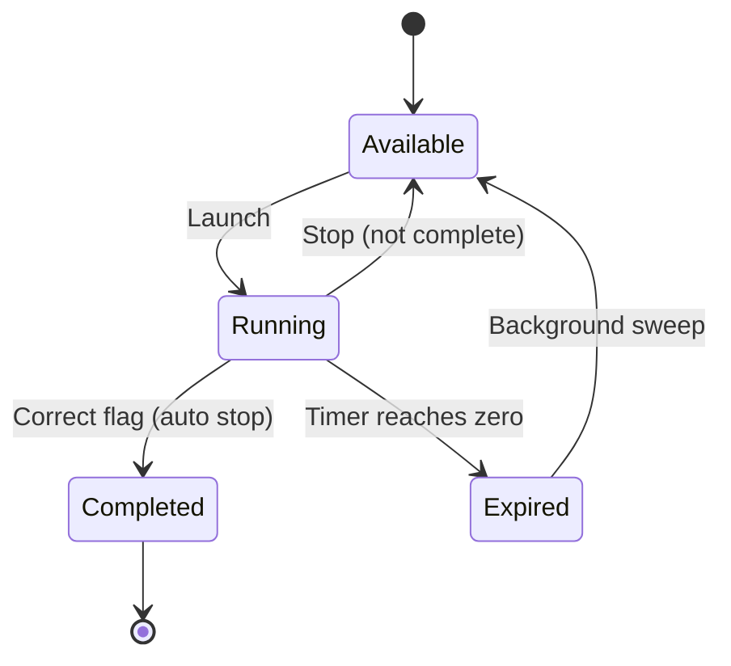

# Stopping a Lab

Stop a lab when you want to end a session before solving it, switch to a different exercise, or free your single active session slot. Stopping tears down the lab environment and returns the lab to its available state.

## Prerequisites

- A running lab session. See [Launching a Lab](04_Launching_a_Lab.md).

## Two ways to stop

You can stop from two controls, both of which run the same teardown:

- The red **Stop** button on the lab row in the track page.
- The **Stop Exercise** button in the header of the Active Lab panel.

<figure markdown>

<figcaption>The Stop Exercise button sits in the Active Lab panel header, beside the session timer and the +1 Hour control.</figcaption>
</figure>

## Steps

1. Open the Active Lab panel, or find the lab row showing your running session.
2. Click **Stop Exercise** (or **Stop** on the row).
3. A confirmation dialog asks "Are you sure you want to stop this exercise?". Click OK.
4. The panel clears and the lab returns to its available state. If you launched the lab from a course, you return to the course page; otherwise the track view refreshes.

**What you should see:** the Active Lab panel closes, the timer disappears, and the lab row shows a **Launch** button again instead of an active session.

## Stopping is not completing

Stopping a lab does not mark it complete. Only a correct flag advances your progress. If you stop a lab before submitting the correct flag, you lose any work inside that environment and the lab stays incomplete.

A correct flag also stops the lab automatically. See [Submitting Flags](07_Submitting_Flags.md) for the auto teardown behavior.

The lifecycle below shows where Stop fits relative to launch, solve, and expiry.

!!! warning "Your environment is destroyed"
    Stopping a lab tears down its containers and network. Any shells, files, or notes inside the lab disappear. Copy anything you need out first.

!!! note "Single active session"
    You can run only one lab at a time. Stopping your current lab frees the slot so you can launch another. Launching a second lab while one runs returns the error "You already have an active lab session. Please stop it first."

If the Stop button does nothing, or you cannot launch a new lab afterward, see [Lab Fails to Start](../07_Troubleshooting/03_Lab_Fails_to_Start.md).
