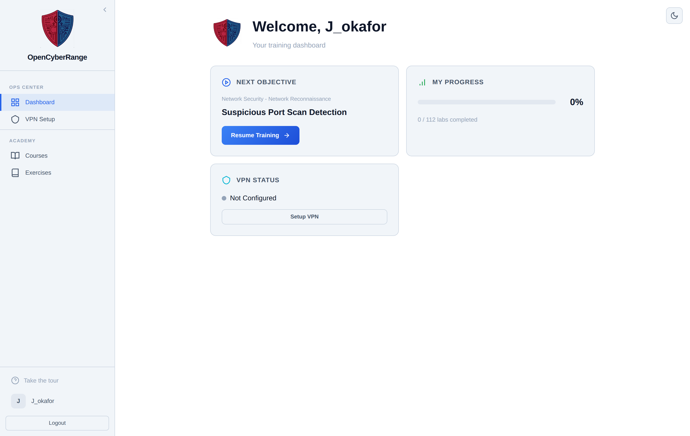
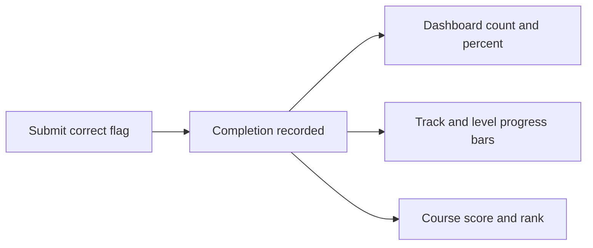

# Tracking Your Progress

Track how many exercises you have solved, see which exercise comes next, and check your standing in a course. Progress surfaces appear on your dashboard, on the Exercises hub, and inside each track.

## Where progress shows

Your progress appears in four places:

- **Dashboard cards:** Next Objective, My Progress (a bar plus "X / Y labs completed"), VPN Status, and Your Rank.
- **Exercises hub:** a three stat summary at the top (Completed, Total Exercises, Overall Progress percent) plus a progress bar on each track card.
- **Track page:** a per level completion ring and a green "Complete" badge when a level is finished.
- **Course scoreboard:** your rank and points inside a course. See [Viewing the Scoreboard](14_Viewing_the_Scoreboard.md).

<figure markdown>

<figcaption>The dashboard shows your next exercise, completed count, VPN state, and course rank when you are enrolled in an active course.</figcaption>
</figure>

## What counts as completed

A lab counts as completed only when you submit its correct flag. Opening a lab, working in it, or stopping it does not advance your progress. The platform records a completion when a flag is solved, so your numbers reflect solved exercises, not attempts.

## How your dashboard numbers are built

The diagram below shows how a solved flag flows into the progress surfaces.

## Course scoring

Inside a course, your rank uses a points formula. Each solved lab earns a base score, with bonuses for solving without hints and on your first attempt.

| Source | Points |
|--------|--------|
| Each completed lab | 100 |
| Solved with no hints | 25 |
| Solved on first attempt | 25 |

!!! note "Rank card is conditional"
    The Your Rank card appears only when you are enrolled in an active course that has assigned labs. If you are not enrolled in such a course, the card does not render and your dashboard shows progress without a rank.

!!! tip "All labs completed"
    When you finish every available exercise, the Next Objective card reads "All labs completed!" instead of pointing to a next lab.

Course exclusive labs count toward your progress only while you are enrolled and the course is active. To see your full account state and enrollment, open [Viewing Your Profile](16_Viewing_Your_Profile.md).
