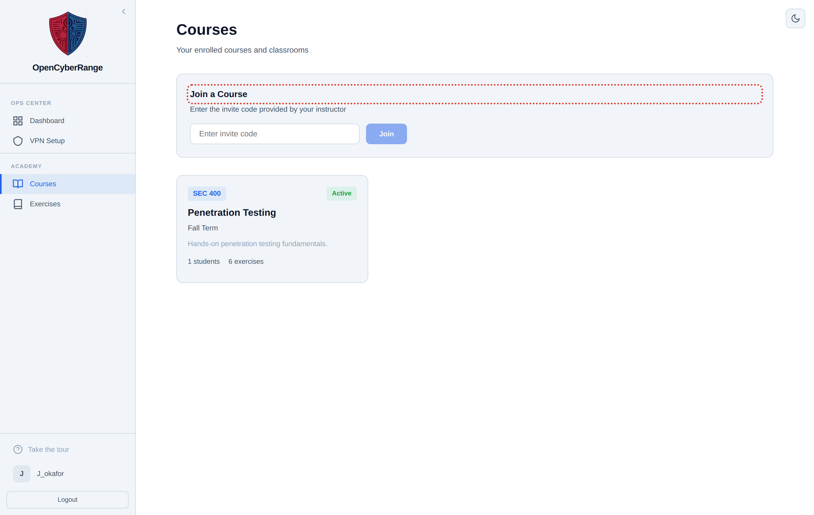
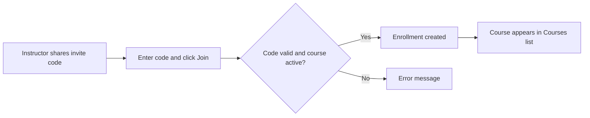

# Joining a Course

Join a course to access its assigned labs, course wiki, scoreboard, and achievements. You join with an invite code that your instructor shares.

## Prerequisites

- An approved account. See [Registering an Account](../01_Getting_Started/04_Registering_an_Account.md).
- An invite code from your instructor.

## Two entry points

You can join a course from either of two screens, both of which submit the same code:

- The **Join a Course** card on the Courses page.
- The Course Enrollment section on your profile. See [Viewing Your Profile](16_Viewing_Your_Profile.md).

## Steps

1. Open **Courses** from the sidebar.
2. In the **Join a Course** card, type the invite code your instructor gave you into the invite code field.
3. Click **Join**. The button reads "Joining..." while it works.
4. Read the message below the field. On success it confirms enrollment and the course appears in your course list.

**What you should see:** a success message and a new course card in your list. Open the card to reach the course exercises, scoreboard, and achievements.

<figure markdown>

<figcaption>The Courses page lists your enrolled courses and provides the invite code field to join a new one.</figcaption>
</figure>

The flow below shows what happens from receiving a code to seeing the course.

## Join errors

| Message | Cause | Fix |
|---------|-------|-----|
| Invalid invite code or course is not active | Code is wrong or the course is inactive | Confirm the exact code with your instructor |
| This course has ended | The course end date has passed | Ask your instructor whether the course is still open |
| Already enrolled in this course | You already joined | Open the course from your list |

!!! note "Inactive courses stay hidden"
    Even after you enroll, a course that is inactive does not appear in your course list. You see only active enrollments.

!!! tip "Codes are case sensitive"
    Type the invite code exactly as given. A trailing space or a changed letter case can produce the "Invalid invite code" error.

Once enrolled, work through the assigned labs on the [Course Labs and Assignments](13_Course_Labs_and_Assignments.md) page.
