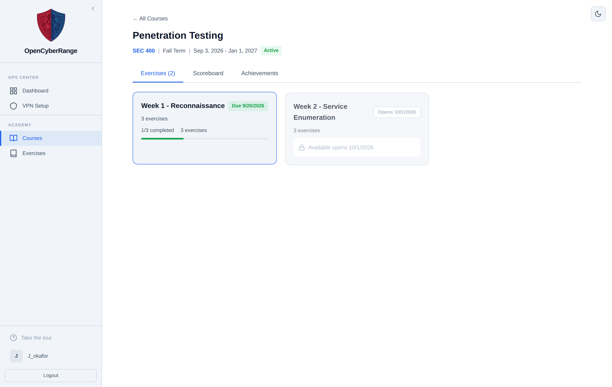
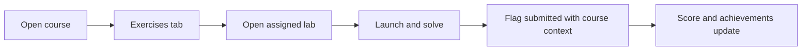

# Course Labs and Assignments

Work through the labs your instructor assigns inside a course. Solving a lab from the course view credits the course scoreboard and opens the course wiki instead of the public track wiki.

## Prerequisites

- Enrollment in an active course. See [Joining a Course](12_Joining_a_Course.md).

## The course view

Open a course from your Courses list to reach its tabs:

- **Exercises:** the assignments and their labs.
- **Scoreboard:** the course leaderboard. See [Viewing the Scoreboard](14_Viewing_the_Scoreboard.md).
- **Achievements:** the badges you earn in the course. See [Achievements and Badges](15_Achievements_and_Badges.md).

The Exercises tab groups labs into assignments. Each assignment shows its labs, and the heading shows how many exercises it contains. A locked assignment displays "This assignment is locked by your instructor" until your instructor opens it. Drill labs carry a blue **Drill** badge.

<figure markdown>

<figcaption>The Exercises tab lists each assignment with its labs; locked assignments show a notice and drill labs carry a Drill badge.</figcaption>
</figure>

## Steps

1. Open the course from **Courses**.
2. Stay on the **Exercises** tab.
3. Find an unlocked assignment and click an assigned lab.
4. Launch the lab and solve it as usual. See [Launching a Lab](04_Launching_a_Lab.md) and [Submitting Flags](07_Submitting_Flags.md).

**What you should see:** the lab opens with the course context attached. When you submit a correct flag, the solve counts toward the course scoreboard and the Open Workbook button points to the course wiki.

The path below shows how a course lab gives course credit.

## Course only labs

Some labs are assigned only through a course. Course only labs do not appear in the main Exercises hub; you reach them solely from the course view. They open even when sequential track locking would otherwise hide them, because your enrollment grants access.

!!! note "Course wiki needs active enrollment"
    The course workbook opens only while the course is active and you are enrolled. An ended or inactive course returns an access error when you open its wiki.

!!! warning "Locked assignments are instructor controlled"
    If an assignment shows "This assignment is locked by your instructor", you cannot open its labs yet. Wait until your instructor unlocks it.

If a course lab will not open or its workbook is blocked, see [Cannot Reach Lab Target](../07_Troubleshooting/05_Cannot_Reach_Lab_Target.md).
