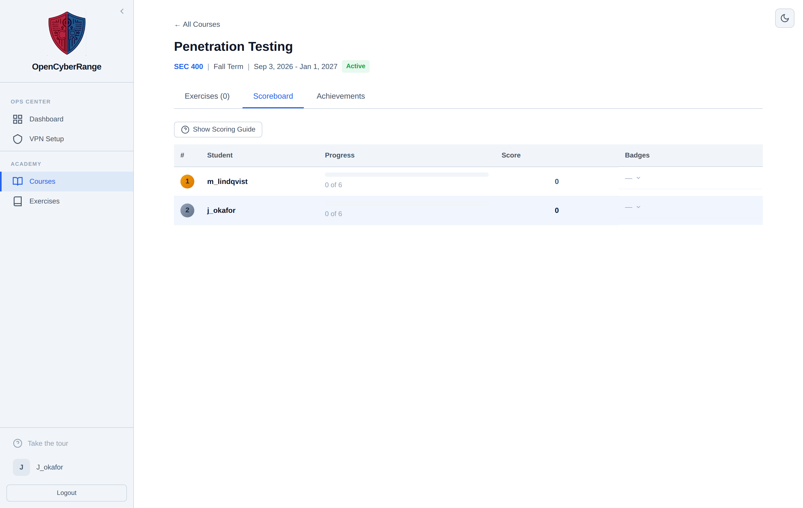

# Viewing the Scoreboard

Check the course scoreboard to see your rank against classmates, your points, and the badges you have earned. The scoreboard is per course; it is not a platform wide leaderboard.

## Prerequisites

- Enrollment in a course. See [Joining a Course](12_Joining_a_Course.md).

## Opening the scoreboard

1. Open the course from **Courses**.
2. Click the **Scoreboard** tab.

**What you should see:** a ranked table with one row per student showing rank, name, a progress bar reading "X of Y", and a badge count. Expand any row to see per lab scores and achievement icons.

<figure markdown>

<figcaption>The scoreboard ranks every enrolled student by points and shows each student's progress and earned badges.</figcaption>
</figure>

## How points are scored

A collapsible **Scoring Guide** on the tab explains the points. Your score comes from solved labs plus two bonuses.

| Source | Points |
|--------|--------|
| Each completed lab | 100 |
| Solved with no hints | 25 |
| Solved on first attempt | 25 |

Expanding your row breaks the total down by lab, so you can see which solves and bonuses contributed.

## Rank versus dashboard

The scoreboard rank is specific to one course. The Your Rank card on your dashboard reflects your first enrolled active course. To see ranks in other courses, open each course and view its Scoreboard tab.

!!! note "Empty scoreboard"
    Before anyone in the course solves a lab, the scoreboard shows an empty state. Solve an assigned lab to appear on it. See [Course Labs and Assignments](13_Course_Labs_and_Assignments.md).

!!! tip "Earn the bonuses"
    Solving without requesting a hint and getting the flag on your first attempt each add 25 points. Requesting a hint forfeits the no hints bonus for that lab. See [Using Hints](08_Using_Hints.md).

The badges in the scoreboard rows are course achievements. See [Achievements and Badges](15_Achievements_and_Badges.md) for what each one means.
