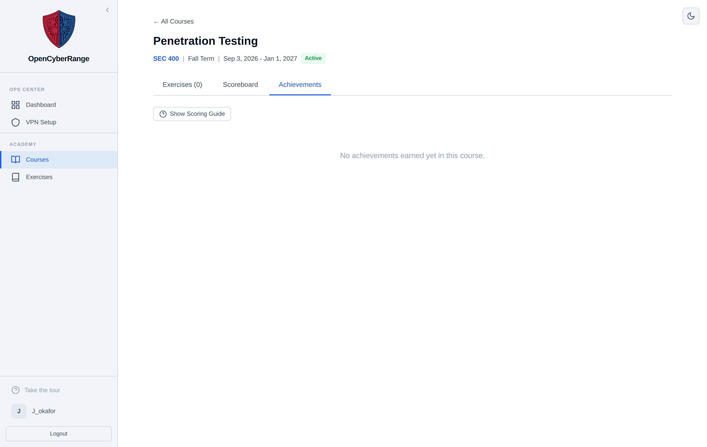

# Achievements and Badges

Earn achievements for how you solve labs inside a course: solving first, solving without hints, solving on your first attempt, and finishing fast. Achievements are course scoped; the icons shown as badges on the scoreboard are these same achievements.

## Prerequisites

- Enrollment in a course. See [Joining a Course](12_Joining_a_Course.md).

## Where achievements appear

Achievements show in two places inside a course:

- The **Achievements** tab, which lists each earned achievement with an icon and label.
- As badge icons on each row of the **Scoreboard** tab.

## Opening the Achievements tab

1. Open the course from **Courses**.
2. Click the **Achievements** tab.

**What you should see:** a list of achievements you have earned in the course, each with an icon and a short label. Before you earn any, the tab reads "No achievements earned yet in this course."

<figure markdown>

<figcaption>The Achievements tab lists the achievements you have earned in the course; an empty course shows a no achievements message.</figcaption>
</figure>

## The six achievements

| Achievement | How you earn it |
|-------------|-----------------|
| First Blood | First student in the course to solve a lab |
| Self-Reliant | Solve a lab without requesting any hints |
| Perfectionist | Solve a lab on your first attempt |
| Speed Demon | Solve a lab in under half its estimated time |
| Clean Sweep | Solve every lab in the course |
| On a Roll | Solve three or more in a row with no hints or on first attempt |

## Course scoped only

Achievements exist only inside a course. Solving a lab outside any course earns no achievement, and there is no platform wide badge wall on your profile. To earn achievements, solve labs you reach through a course. See [Course Labs and Assignments](13_Course_Labs_and_Assignments.md).

!!! note "Awarding can lag"
    The platform checks for new achievements right after you submit a correct flag. The check runs in the background, so a badge can take a moment to appear on the tab.

!!! tip "Protect your bonuses"
    Self-Reliant and the points bonus for no hints both depend on solving without help. Requesting a hint forfeits them for that lab. See [Using Hints](08_Using_Hints.md).

To see how achievements feed into your standing, open [Viewing the Scoreboard](14_Viewing_the_Scoreboard.md).
