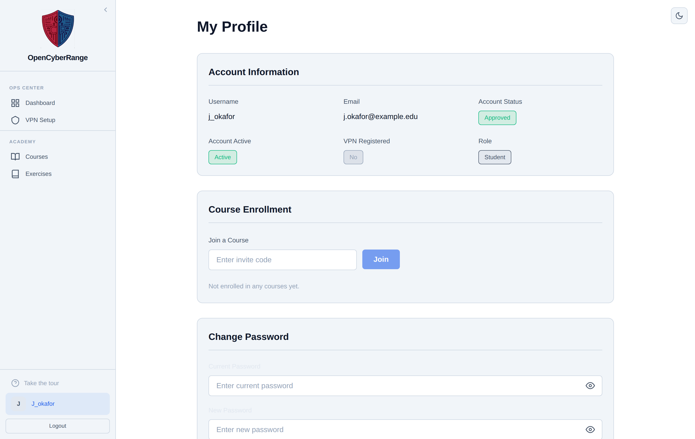

# Viewing Your Profile

Open your profile to check your account details, see your enrolled courses, join a new course, and change your password. The profile is your single account page.

## Opening your profile

Click **Profile** in the sidebar. The page opens with your account information at the top.

<figure markdown>

<figcaption>The profile page shows your account fields, your enrolled courses, a join by code form, and the change password section.</figcaption>
</figure>

## Account Information

The Account Information grid shows:

| Field | Meaning |
|-------|---------|
| Username | Your login name |
| Email | The address on your account |
| Account Status | Approved or Pending |
| Account Active | Whether your account is enabled |
| Registration Date | When you registered |
| VPN Registered | Yes or No, whether your VPN peer is set up |
| Role | Student, Instructor, or Admin |

## Course Enrollment

The Course Enrollment section holds a join by code form and your My Courses list. You can join a course here exactly as on the Courses page. See [Joining a Course](12_Joining_a_Course.md).

## Change Password

A Change Password section is embedded on the profile page. For the full procedure and the password rules, see [Changing Your Password](17_Changing_Your_Password.md).

!!! note "VPN Registered field"
    The VPN Registered field reads Yes only after you download your VPN config and your peer registers. If it reads No, download your config. See [Connecting via VPN](05_Connecting_via_VPN.md).

!!! tip "Account Status Pending"
    A new account shows Account Status as Pending until an admin approves it. While pending, you cannot launch labs. Approval is required once, after registration.
