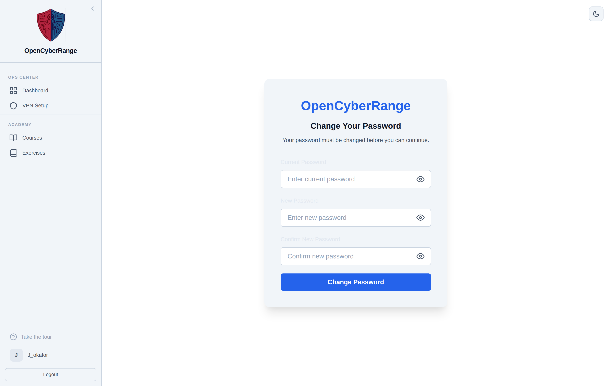
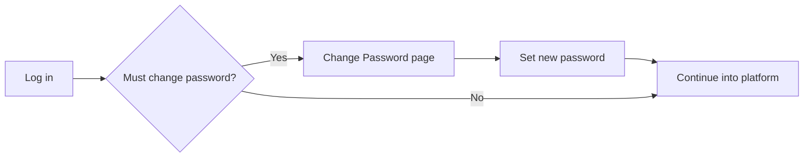

# Changing Your Password

Change your password whenever you want a new one, or when the platform requires it before you continue. The same form serves both the voluntary change and the forced change.

## Prerequisites

- You know your current password. See [Logging In](../01_Getting_Started/05_Logging_In.md).

## Two entry points

You can change your password from either place:

- The full **Change Password** page, which the platform sends you to when a password change is required.
- The Change Password section on your profile. See [Viewing Your Profile](16_Viewing_Your_Profile.md).

## Steps

1. Open the Change Password page or the profile section.
2. In **Current Password**, type the password you log in with now.
3. In **New Password**, type your new password.
4. In **Confirm New Password**, type the new password again.
5. Click **Change Password**. The button reads "Changing Password..." while it works.

**What you should see:** a success result. After a forced change, you continue into the platform. Each field has a show or hide toggle so you can check what you typed.

<figure markdown>

<figcaption>The change password form takes your current password, a new password, and a confirmation, each with a show or hide toggle.</figcaption>
</figure>

## Password rules

Your new password must meet all of these:

- At least 8 characters.
- At least one uppercase letter.
- At least one lowercase letter.
- At least one number.

An example that meets the rules is `Range2026#`. Use `#` rather than `!` in your passwords.

## Forced change

When your account is flagged to change its password, the platform redirects you to the Change Password page and keeps you there until you set a new password. A banner reads "Your password must be changed before you can continue." Complete the form to clear the requirement and continue.

## Errors

| Message | Cause | Fix |
|---------|-------|-----|
| Current password is incorrect | The current password did not match | Re-enter your current password |
| Passwords do not match | New and confirm differ | Type the same value in both new fields |
| Weak password | Missing a length or character class | Meet all four rules above |

!!! note "Submission is rate limited"
    Repeated attempts are limited. If you submit too many times in a short window, wait a minute before trying again.

If you cannot log in to reach this page, see [Login Issues](../07_Troubleshooting/01_Login_Issues.md).
