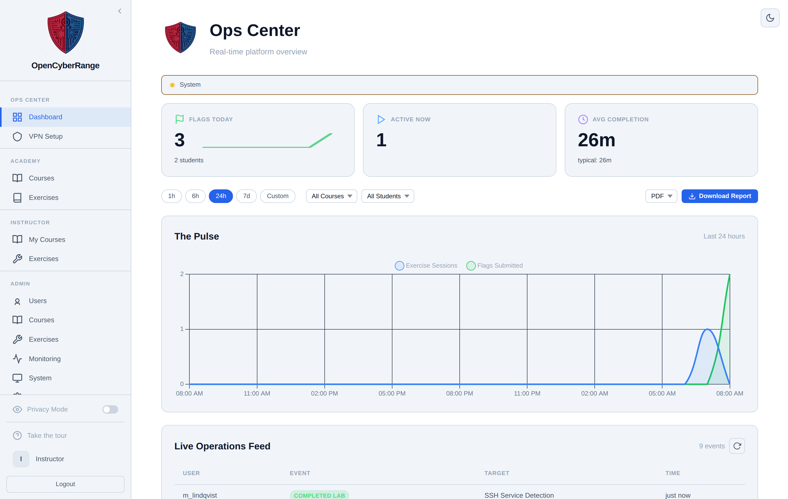
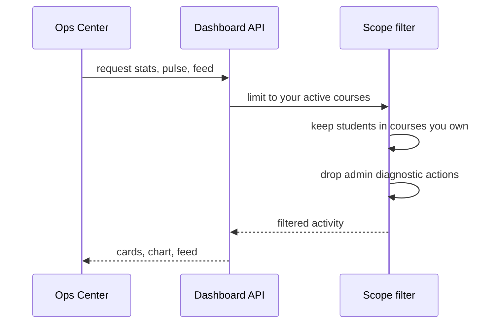

# Instructor Dashboard (Ops Center)

The Ops Center is your landing page after you sign in as an instructor. The page gives you a read-only, real-time view of how your students are doing: how many flags they captured today, how many labs are running right now, and how long completions are taking. You use it to take the pulse of your class before drilling into a specific course.

!!! note "One account is admin and instructor in Lite"
    OCR Lite runs on a single privileged account. You are the administrator and the instructor at once: you create courses, enroll students, and assign labs from the same login. Where this guide says "instructor," it means you. The edition does not create separate instructor logins; that is a paid-tier feature.

## Prerequisites

- You are signed in to the privileged account. In OCR Lite that single account is both administrator and instructor, so everything in this guide is done from the account you created during first-run setup. There is no separate instructor account to register or approve.
- At least one course assigned to you, so the figures have data to report. See [Creating a Course](02_Creating_a_Course.md).

## Where it lives

The Ops Center opens at the **Dashboard** entry in the left sidebar. The platform routes instructor and admin accounts to the Ops Center automatically; students land on the student dashboard instead.

<figure markdown>

<figcaption>The Ops Center: three stat cards across the top, the Pulse activity chart, and the Live Operations Feed below.</figcaption>
</figure>

## Reading the three stat cards

The cards summarize activity across the students enrolled in your active courses.

| Card | What it shows |
|------|---------------|
| Flags Today | The number of correct flags submitted today, a 7-day sparkline, and the count of students who contributed. |
| Active Now | The number of lab sessions running at this moment. When nothing is running, the card reads "No active sessions". |
| Avg Completion | Today's average completion time in minutes, color-coded against the typical time for your courses. Green means faster than usual, amber means slower. When no completions have a recorded time, the card reads "no data yet". |

## Filtering and reading the feed

1. Use the preset pills (**1h**, **6h**, **24h**, **7d**, **Custom**) to set the time window. Pick **Custom** to enter an exact start and end with the date pickers.
2. Narrow the view with the **All Courses** and **All Students** dropdowns to focus on one course or one learner.
3. Read the three cards for the headline numbers.
4. Scan **The Pulse** chart for activity over time. The chart buckets by hour for windows up to 48 hours and by day for longer windows. When there is nothing to plot, it reads "No activity data yet".
5. Review the **Live Operations Feed** table (User, Event, Target, Time). Use the refresh button to pull the latest events and **Load More** to page back through history.

**What you should see:** The cards, chart, and feed all reflect the window and course or student you selected. Usernames in the feed appear masked only when Privacy Mode is on, the optional sidebar toggle that is off by default.

## Exporting a report

1. Set the filters you want to capture.
2. Choose **PDF** or **CSV** in the export format selector.
3. Click **Download Report**.

**What you should see:** The browser downloads a report of the currently filtered view.

## What the dashboard counts

The figure below shows where the Ops Center gets its numbers and how scope is applied before anything renders.

As an instructor, the Ops Center counts only the students in courses you own that are currently **active**. An archived course's students drop out of the figures.

!!! note
    Admin diagnostic activity is excluded from every stat, the Pulse chart, and the feed, so platform housekeeping does not skew your class numbers.

!!! tip
    Avg Completion only counts completions that have a recorded time greater than zero. Very fast or instantly resolved labs may not contribute to the average.

The System Health bar above the cards appears for administrators only. As an instructor you will not see it.

For deeper, per-student detail, open a course and use the Students sub-tab described in [Monitoring Student Progress](09_Monitoring_Student_Progress.md).
