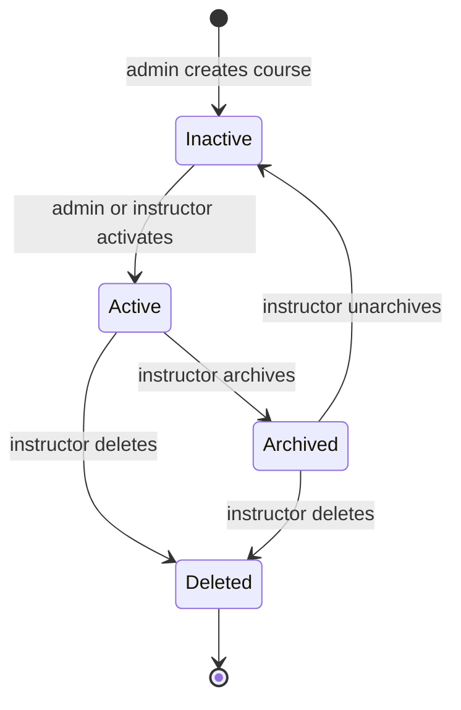

# Creating a Course

Course creation on the platform is an administrator action. As an instructor you do not create the course yourself; you ask an administrator to create it and assign it to you. Once the course exists and is assigned, you manage everything about it: settings, invite code, labs, assignments, and reports. The page explains the boundary so you know exactly what to request and what you can do afterward.

## Prerequisites

- An approved instructor account. See [Registering an Account](../01_Getting_Started/04_Registering_an_Account.md).
- An administrator who can create the course for you.

## Why instructors do not create courses

The **Instructor Panel** (the **Instructor** entry in the left sidebar) lists only the courses already assigned to you. When you have none, the panel reads "No courses assigned yet. Contact your administrator to create a course." There is no create-course button in the instructor workspace by design: the create and bulk-enroll actions are reserved for administrators.

## What to give your administrator

Provide the administrator with the details below so the course is set up correctly the first time.

| Detail | Why it matters |
|--------|----------------|
| Course name | The display name students see, for example "Cyber Security Fundamentals". |
| Course code | A short identifier, for example CYB-3350. |
| Semester | Used for organizing and reporting. |
| Start date and end date | The end date must be after the start date. |
| Instructor owner | Name yourself (or another instructor) as the owner so the course appears in that person's Instructor Panel. |

The administrator creates the course from the Admin panel. See the Admin Guide for the administrator-side steps.

## The course lifecycle

The figure shows who does what across the life of a course and where the admin and instructor responsibilities meet.

A freshly created course starts **inactive** and is invisible to students until someone activates it. After the course is assigned to you, you can:

- Edit its settings. See [Managing Course Settings](03_Managing_Course_Settings.md).
- Share its invite code so students self-enroll. See [Generating and Sharing Invite Codes](04_Generating_and_Sharing_Invite_Codes.md).
- Assign labs and build assignments. See [Assigning Labs to a Course](07_Assigning_Labs_to_a_Course.md).

!!! warning
    A new course is inactive. Students cannot join or see it until it is activated, even if you share the invite code. Confirm the course is active before distributing the code.

!!! note
    Administrators may also bulk-enroll students directly. As an instructor your enrollment path is the invite code; see [Enrolling Students](05_Enrolling_Students.md).
