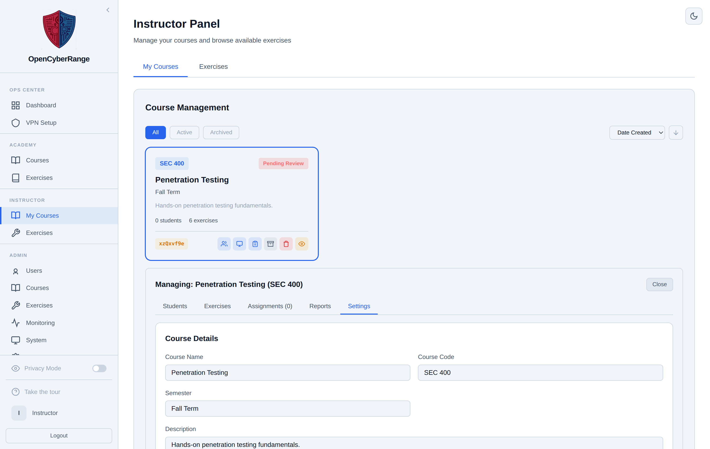

# Managing Course Settings

The Settings sub-tab is where you edit the descriptive details of a course you own: its name, code, semester, description, and dates. You use it when a course needs to be relabeled or rescheduled after an administrator created it. Editing settings is an instructor action, unlike creating the course or bulk-enrolling students.

## Prerequisites

- A course assigned to you. See [Creating a Course](02_Creating_a_Course.md).

## Opening the settings form

1. Open the **Instructor** entry in the left sidebar to reach the Instructor Panel.
2. On the **My Courses** tab, open the course you want to edit.
3. Select the **Settings** sub-tab.

<figure markdown>

<figcaption>The Settings sub-tab shows the course name, code, semester, description, and dates, plus Save Changes and Reset.</figcaption>
</figure>

## Editing the fields

The table lists the fields you can edit here.

| Field | Notes |
|-------|-------|
| Course Name | The display name students see. |
| Course Code | The short identifier, for example CYB-3350. |
| Semester | Free text used for organizing the course. |
| Description | A short summary shown to enrolled students. |
| Start Date | The date the course begins. |
| End Date | Must be after the start date. |

1. Change the fields you need.
2. Click **Save Changes** to apply, or **Reset** to discard your edits and restore the saved values.

**What you should see:** The form confirms the save and the new values persist when you reopen the Settings sub-tab.

!!! note
    The course wiki slug and theme color are set when the administrator creates the course. The Settings sub-tab does not edit them.

!!! tip
    Keep names and descriptions free of em-dashes and en-dashes. The PDF report generator cannot render Unicode dashes, so a dash in a course name can break a generated report. Use a comma, colon, or period instead.

To activate, archive, or delete the course, use the course card actions described in [Archiving a Course](13_Archiving_a_Course.md) and [Deleting a Course](14_Deleting_a_Course.md). If a field will not save, see [Login Issues](../07_Troubleshooting/01_Login_Issues.md) to confirm your session is still valid.
