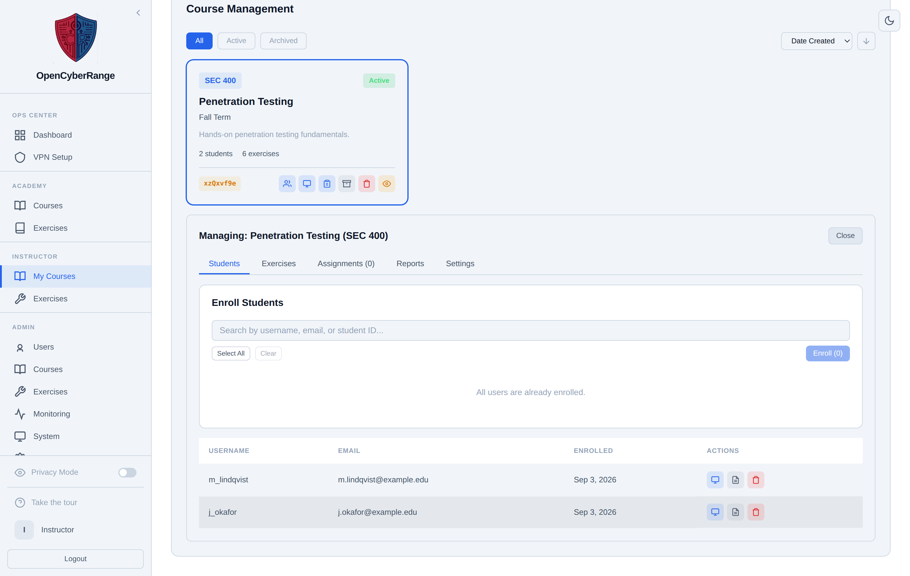

# Generating and Sharing Invite Codes

Every course has an invite code. The code is how students self-enroll: they enter it on their My Courses screen and join the course without any action from you or an administrator. The page shows you how to find, share, and regenerate the code.

## Prerequisites

- A course assigned to you. See [Creating a Course](02_Creating_a_Course.md).
- The course is active, so students can use the code. See [Managing Course Settings](03_Managing_Course_Settings.md).

## Finding and copying the code

The invite code appears on the course card and on the course Students sub-tab.

1. Open the **Instructor** entry in the left sidebar.
2. On the **My Courses** tab, find the course card. The footer shows the invite code as a chip.
3. Click the invite chip to copy the code to your clipboard.

<figure markdown>

<figcaption>The Students sub-tab displays the roster and the course invite code that students use to self-enroll.</figcaption>
</figure>

**What you should see:** The code copies to your clipboard. Paste it into your syllabus, learning management system, or a message to your students.

## How students use the code

A student opens their **My Courses** screen, enters the invite code, and joins. The student must hold a student-role account and the course must be active. See [Joining a Course](../02_Student_Guide/12_Joining_a_Course.md) for the student-side steps.

## Regenerating the code

If a code leaks or you want to cut off further sign-ups, regenerate it. Regenerating replaces the current code with a new one.

1. From the course view, use the regenerate action on the invite code.
2. Share the new code with anyone who still needs to join.

**What you should see:** The chip displays a new code. The previous code stops working immediately.

!!! warning
    Regenerating invalidates the old code. Students who have not yet joined will need the new code, but students already enrolled stay enrolled.

!!! note
    The invite code is the instructor-available enrollment path. Bulk enrollment from a roster is an administrator action. See [Enrolling Students](05_Enrolling_Students.md).
