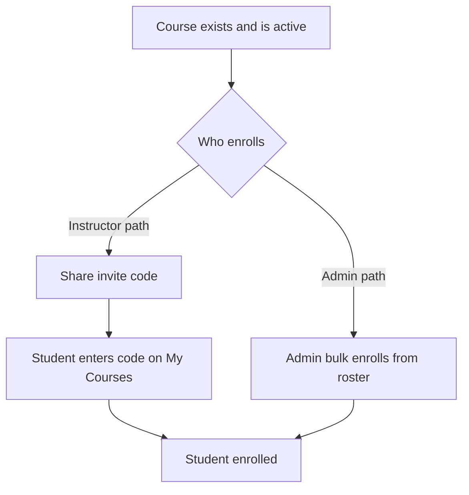

# Enrolling Students

There are two ways students get into a course: they self-enroll with the invite code, or an administrator bulk-enrolls them from the roster. As an instructor, your path is the invite code. Bulk enrollment is an administrator action. The page explains both so you know which to use and what to ask for.

## Prerequisites

- A course assigned to you and active. See [Managing Course Settings](03_Managing_Course_Settings.md).
- The course invite code. See [Generating and Sharing Invite Codes](04_Generating_and_Sharing_Invite_Codes.md).

## The two enrollment paths

The figure shows both routes into a course and who can take each.

### Instructor path: share the invite code

The path available to you. Copy the course invite code and give it to your students; each student enters it on their My Courses screen and joins on their own. See [Generating and Sharing Invite Codes](04_Generating_and_Sharing_Invite_Codes.md) and the student-side [Joining a Course](../02_Student_Guide/12_Joining_a_Course.md).

### Admin path: bulk enrollment

An administrator can add students to a course directly from the user roster. The enroll controls (a search box, Select All, Clear, per-user checkboxes, and an "Enroll (N)" button) appear only for administrators on the Students sub-tab.

<figure markdown>

<figcaption>The Students sub-tab. The bulk-enroll controls appear here for administrators; instructors see the roster and invite code.</figcaption>
</figure>

When you open the Students sub-tab as an instructor, you see the roster and a note that students are enrolled by an administrator, rather than the enroll controls.

## What to request from your administrator

If you need a set of students added without the invite code, ask an administrator to bulk-enroll them. Only active, student-role accounts can be enrolled; already-enrolled students and non-students are skipped automatically.

!!! note
    The invite code is the fastest path for a normal class: distribute it once and students join themselves. Reserve the admin bulk-enroll request for cases where students cannot use the code.

!!! tip
    A student must have an approved student-role account before either path works. See [Registering an Account](../01_Getting_Started/04_Registering_an_Account.md).

To remove a student later, see [Removing Students](06_Removing_Students.md).
