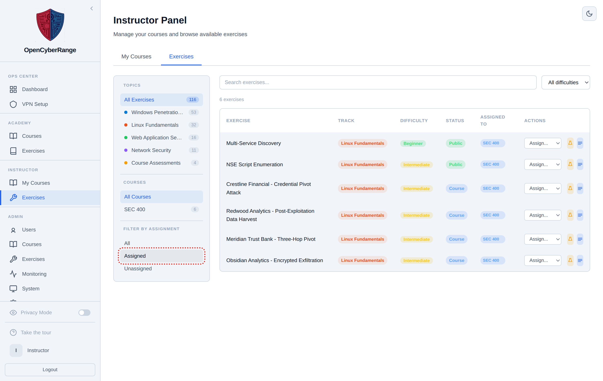

# Assigning Labs to a Course

Assigning labs is how you build the practical content of a course. From the Exercises sub-tab you pick which labs your enrolled students can launch, give them per-course display names, and remove ones you no longer need. The page covers assigning and unassigning labs; ordering them is covered separately in [Reordering Course Labs](08_Reordering_Course_Labs.md).

## Prerequisites

- A course assigned to you. See [Creating a Course](02_Creating_a_Course.md).

## Opening the Exercises sub-tab

1. Open the **Instructor** entry in the left sidebar.
2. On the **My Courses** tab, open the course.
3. Select the **Exercises** sub-tab.

<figure markdown>

<figcaption>The Exercises sub-tab: the Assigned Exercises accordion on one side and the Assign Exercises picker on the other.</figcaption>
</figure>

The sub-tab has two parts:

- **Assigned Exercises**: an accordion grouped by track and level, listing the labs already in the course. Each entry has Remove, a rename (pencil) control, and a launch (play) control. A Remove All control clears a group.
- **Assign Exercises**: an accordion of available labs with checkboxes, an **Add All** control, and an **Assign Selected (N)** button.

## Assigning labs

1. In the **Assign Exercises** accordion, expand the track and level you want.
2. Tick the checkbox next to each lab to add, or use **Add All** for a whole group.
3. Click **Assign Selected (N)**.

**What you should see:** The selected labs move into the **Assigned Exercises** accordion. This adds them to the course's exercise pool; students do **not** see them yet. Students see a lab once you place it in an **Assignment** (a dated unit, usually a week). Create one and add these labs to it -- see [Creating and Managing Assignments](15_Creating_and_Managing_Assignments.md). Until then the student's course page shows "Exercises (0)".

## Renaming a lab for the course

1. In **Assigned Exercises**, click the rename (pencil) control on a lab.
2. Enter a per-course display name.
3. Save.

**What you should see:** The lab shows your custom name in the course. Leaving the name blank restores the lab's default title.

## Removing a lab

1. In **Assigned Exercises**, click **Remove** on the lab, or **Remove All** for a whole group.

**What you should see:** The lab returns to the **Assign Exercises** picker and is no longer available to students in the course.

## Adding exercises from the picker

The **+ Add exercises** button opens a picker for adding labs **From an existing lab**. Pick the track, level, and labs you want from the built-in catalog, then add them to the course.

!!! note
    Labs with course-only visibility appear only inside the course view and stay hidden from the main exercise catalog. Assigning such a lab is what lets your enrolled students reach it.

!!! tip
    A per-course display name only changes the label inside this course. The underlying lab and its flag are unchanged.

To set the order students see these labs in, continue to [Reordering Course Labs](08_Reordering_Course_Labs.md). To group labs into timed weeks, see [Creating and Managing Assignments](15_Creating_and_Managing_Assignments.md).
