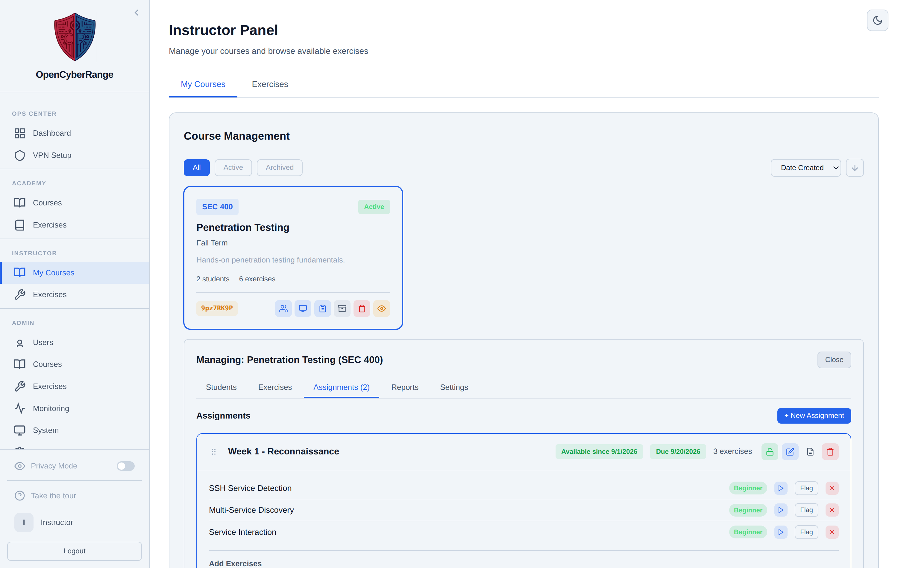
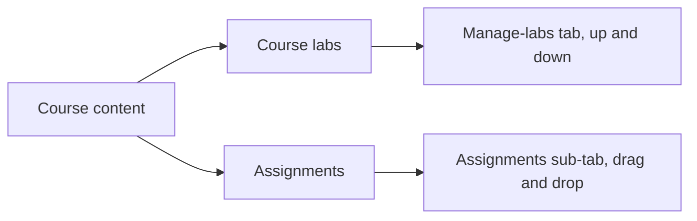

# Reordering Course Labs

Reordering sets the sequence in which labs appear to students in a course. You change the order from the course detail view, using up and down controls on each lab. The page also clarifies the difference between reordering course labs and reordering assignments, because they use different mechanisms in different places.

## Prerequisites

- A course assigned to you with labs already assigned. See [Assigning Labs to a Course](07_Assigning_Labs_to_a_Course.md).

## Where reordering lives

Course-lab reordering is in the **course detail view**, not the Instructor Panel. Open the course (the course detail page) and select the **manage-labs** tab. Each lab row has up and down controls.

<figure markdown>

<figcaption>The assigned labs you reorder. Up and down controls in the manage-labs view set the sequence students see.</figcaption>
</figure>

## Reordering the labs

1. Open the course detail view and select the **manage-labs** tab.
2. Find the lab you want to move.
3. Click the up control to move it earlier or the down control to move it later.

**What you should see:** The lab shifts position and the new order saves immediately. Students see the labs in the order you set.

## Two different reorder mechanisms

The platform orders course labs and assignments separately. The table keeps them straight.

| What you reorder | Where | How |
|------------------|-------|-----|
| Course labs | Course detail view, manage-labs tab | Up and down controls per lab |
| Assignments | Instructor Panel, course Assignments sub-tab | Drag and drop the assignment cards |

!!! note
    Course-lab order uses up and down controls in the course detail view. Assignment order uses drag and drop in the Instructor Panel. The two are separate; reordering one does not change the other.

!!! tip
    If you want students to work through content week by week, group labs into assignments and order the assignment cards by dragging them. See [Creating and Managing Assignments](15_Creating_and_Managing_Assignments.md).
