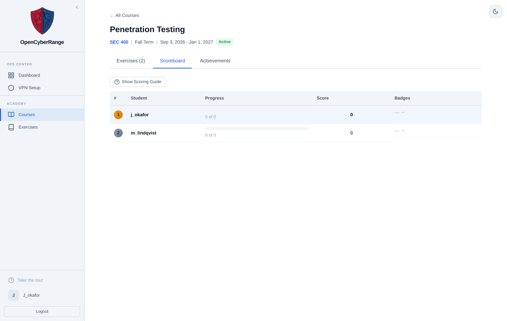

# Viewing the Course Scoreboard

The course scoreboard ranks enrolled students by total score and labs completed, with a per-lab score breakdown. You use it to gauge class standing and to spot exercises that few students have cleared.

## Prerequisites

- You own the course, or you are an administrator. See [03_Managing_Course_Settings.md](03_Managing_Course_Settings.md).
- At least one student has completed at least one assigned lab, so the board has data to rank.

## Open the scoreboard

The scoreboard lives in the course detail view, not in the Instructor Panel.

1. In the left sidebar, select **Instructor Panel**.
2. On the **My Courses** tab, click the course title to open its detail page.
3. Select the **Scoreboard** tab.

**What you should see:** a ranked table listing each student's **Rank**, username, **Total Score**, **Labs Completed**, and per-lab scores. Rows sort by total score first, then by labs completed.

<figure markdown>

<figcaption>The Scoreboard tab ranks enrolled students with a per-lab score breakdown.</figcaption>
</figure>

## Read the scoring breakdown

Each student's total reflects the score earned on every completed lab. A lab's score factors in completion, the number of submission attempts, and the number of hints opened. For the exact model, see [../06_Lab_Workflow_Reference/04_Scoring_System_Explained.md](../06_Lab_Workflow_Reference/04_Scoring_System_Explained.md).

To see the scoring rules from the scoreboard itself, open the **Scoring Guide** toggle. The same guide is shared with the course Achievements tab.

!!! note
    The scoreboard is visible to enrolled students as well, not just to you. Students see the same ranked board from the course detail view.

!!! tip
    If a score looks wrong after you reset a student's lab, the reset removes that lab's contribution and revokes course-wide achievements. See [11_Resetting_a_Student_Lab.md](11_Resetting_a_Student_Lab.md).
