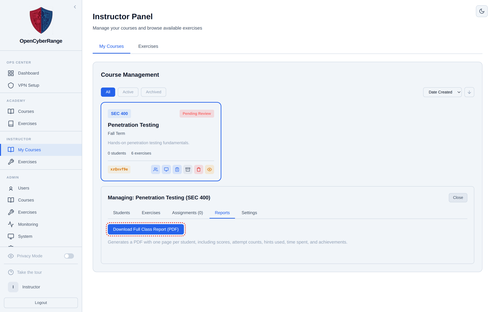

# Generating PDF Reports

The platform produces graded PDF reports at three levels inside a course: the full class, a single student, and a single assignment. You use these to archive grades, share progress with a student, or hand a printable record to a program coordinator.

## Prerequisites

- You own the course, or you are an administrator.
- Students are enrolled and have at least some activity to report.

## Report types

| Report | Where you start it | Contents |
|--------|--------------------|----------|
| Full class report | Course **Reports** sub-tab, **Download Full Class Report (PDF)** | One page per student: scores, attempts, hints, time, achievements |
| Per-student report | Students sub-tab, **Download PDF** in a student's row | One student's full breakdown |
| Per-assignment report | Assignments sub-tab, report button on an assignment card | One assignment's results across students |

The Ops Center also exports a filtered activity report in PDF or CSV from the **Download Report** control. The three course reports above are PDF only.

## Download the full class report

1. In the left sidebar, select **Instructor Panel**.
2. On the **My Courses** tab, click the course.
3. Click the **Reports** sub-tab.
4. Click **Download Full Class Report (PDF)**.

**What you should see:** the button shows **Generating...** while the report builds, then your browser downloads a PDF with one page per enrolled student.

<figure markdown>

<figcaption>The Reports sub-tab builds a class-wide PDF with one page per student.</figcaption>
</figure>

## Download a per-student or per-assignment report

- For one student: open the **Students** sub-tab and click **Download PDF** in that student's row.
- For one assignment: open the **Assignments** sub-tab and click the report button on the assignment card. See [15_Creating_and_Managing_Assignments.md](15_Creating_and_Managing_Assignments.md).

!!! warning
    The PDF generator renders text with a font that handles only the latin-1 character set, and it fails on Unicode dashes. If you set a custom course name, assignment name, or description, use a hyphen, comma, colon, or period instead of an en-dash or em-dash, or the report will not build.

!!! tip
    Reports include masked-out internal identifiers but still list student work. Generate and store them where only authorized staff can read them, and do not share PDFs that contain real student emails.
