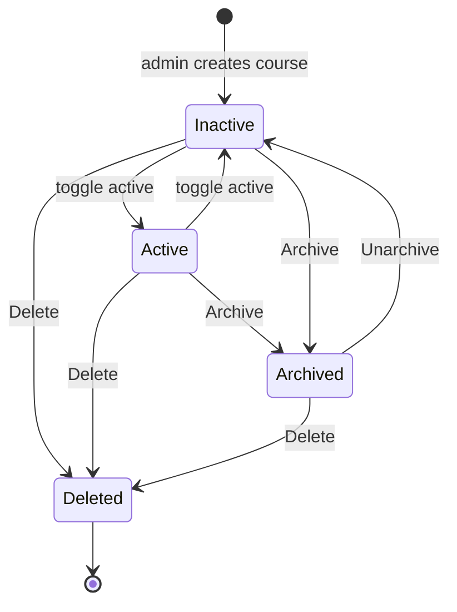

# Archiving a Course

Archiving a course deactivates it and moves it out of your active list at the end of a term, while keeping all enrollments, assignments, and student work intact. You use it to retire a finished section without destroying its data.

## Prerequisites

- You own the course, or you are an administrator.

## Course states

A course moves through three states that you control from the Instructor Panel.

The diagram below shows how a course moves between active, inactive, and archived, and where deletion ends the line.

## Archive a course

1. In the left sidebar, select **Instructor Panel**.
2. On the **My Courses** tab, find the course card.
3. Click the **Archive** icon in the card's actions row.

**What you should see:** the course leaves the Active list. It becomes inactive and is filed under the **Archived** filter pill at the top of the My Courses list.

<figure markdown>

<figcaption>Course management exposes archive, unarchive, and delete controls alongside the editable settings.</figcaption>
</figure>

## Find and unarchive a course

1. On the **My Courses** tab, click the **Archived** filter pill.
2. On the archived course card, click the **Unarchive** icon.

**What you should see:** the course returns to your list, but it stays **inactive**.

!!! warning
    Unarchiving does not reactivate a course. After you unarchive, the course is inactive and students cannot join or open it. Reactivate it as a separate step by toggling the course active in [03_Managing_Course_Settings.md](03_Managing_Course_Settings.md).

!!! note
    Archived courses drop out of Ops Center stats because those cards count only active courses. An archived course's students stop appearing in [09_Monitoring_Student_Progress.md](09_Monitoring_Student_Progress.md) until you reactivate it.

To remove a course permanently instead of archiving it, see [14_Deleting_a_Course.md](14_Deleting_a_Course.md). Archive is reversible; delete is not.
