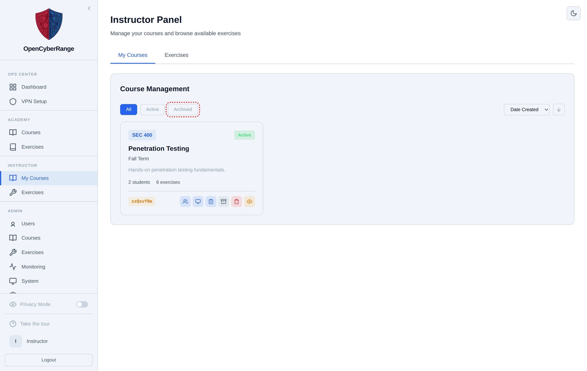

# Deleting a Course

Deleting a course permanently removes it along with its enrollments, lab assignments, assignments, and course achievements. You use it only to discard a course created in error or one you never want to recover. For a reversible alternative, archive the course instead.

## Prerequisites

- You own the course, or you are an administrator.
- You have confirmed you do not need the course's enrollment list, assignment structure, or course achievements again.

## Delete vs archive

| Action | Reversible | Removes data | Use when |
|--------|------------|--------------|----------|
| Archive | Yes (unarchive restores the record) | No | A term ends and you want to keep the course for reference |
| Delete | No | Yes (course, enrollments, assignments, course achievements) | The course was created in error or is no longer wanted |

## Delete a course

1. In the left sidebar, select **Instructor Panel**.
2. On the **My Courses** tab, find the course card.
3. Click the **Delete** icon in the card's actions row.
4. Confirm the deletion when prompted.

**What you should see:** the course disappears from every filter, Active and Archived alike. It cannot be recovered from the interface.

<figure markdown>

<figcaption>The delete control sits in the same actions row as archive, and removal is permanent.</figcaption>
</figure>

## What deletion removes

Deleting a course cascades to the records tied to it: student enrollments in that course, the course's lab assignments, its assignments and assignment labs, and course achievements earned in it. A student's global lab completion history is stored separately and is not part of the course record, so it survives the delete.

!!! warning
    Deletion is permanent and has no undo. If you only want to retire a course at the end of a term, archive it instead. See [13_Archiving_a_Course.md](13_Archiving_a_Course.md).

!!! note
    Course creation is admin-only, so a deleted course cannot be recreated by you. Ask an administrator to create a replacement if you remove a course by mistake. See [02_Creating_a_Course.md](02_Creating_a_Course.md).
