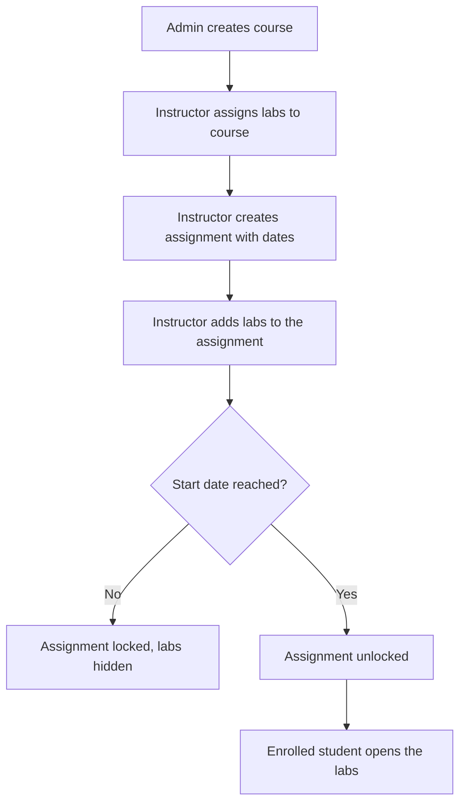
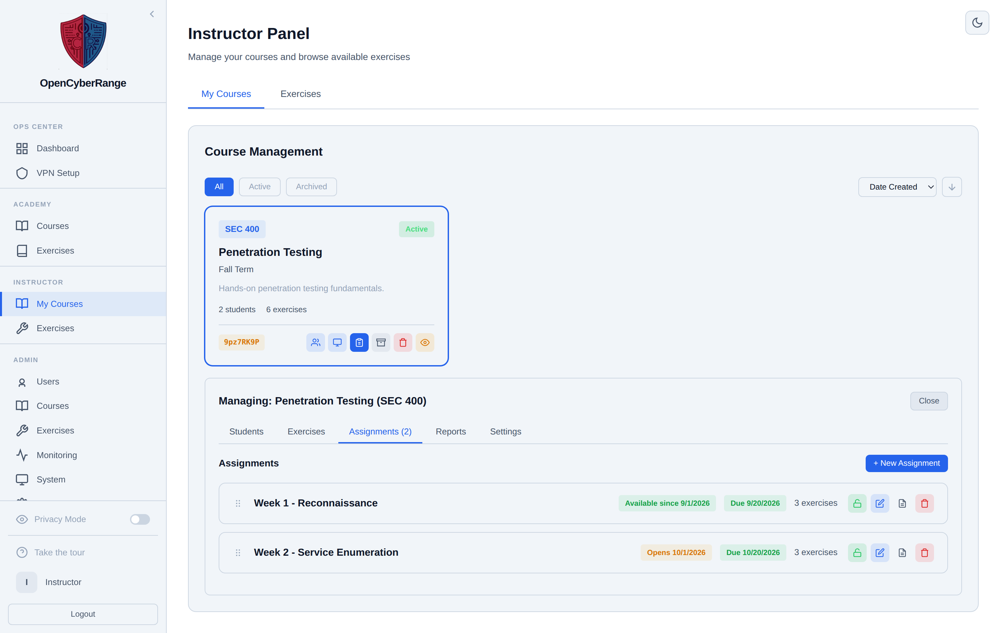

# Creating and Managing Assignments

Assignments group a course's labs into ordered units, usually weeks, each with a start date, a due date, and an availability gate. You use them to pace a course: a future-dated assignment stays locked, hiding its labs from students until the start date arrives.

## Prerequisites

- You own the course, or you are an administrator.
- The labs you plan to group are assigned to the course. See [07_Assigning_Labs_to_a_Course.md](07_Assigning_Labs_to_a_Course.md).

## How assignments fit the course

An assignment is a real record in the course, not just a heading in the wiki navigation. Each assignment holds an ordered set of labs and carries its own dates and lock state. A student joins the course, then sees only the assignments whose start date has arrived.

The diagram below shows the path from enrollment to the labs a student can open.

## Create an assignment

1. In the left sidebar, select **Instructor Panel**.
2. On the **My Courses** tab, click the course.
3. Click the **Assignments** sub-tab.
4. Click **+ New Assignment**.
5. Fill in the name, **start datetime**, **due datetime**, and an optional description.
6. Click **Create**.

**What you should see:** a new assignment card with start and due badges and a lab count of zero.

<figure markdown>

<figcaption>The Assignments sub-tab holds one card per unit with dates, a lab count, and lock and edit controls.</figcaption>
</figure>

## Add labs to an assignment

1. On an assignment card, click to expand it.
2. In the lab picker, grouped by track and level, select the labs to include.
3. Add them to the assignment.

**What you should see:** the assignment's lab count rises, and the chosen labs list under the card.

## Reorder, lock, edit, and delete

- **Reorder:** drag assignment cards into the order you want. The new order saves for the whole class.
- **Lock or unlock:** use the lock toggle on a card. An assignment with a start date in the future is locked, and its labs stay hidden from students until that date.
- **Edit:** open the edit control to change the name, dates, or description.
- **Delete:** remove the assignment; its labs stay assigned to the course and can be regrouped.

!!! note
    Assignment cards reorder by drag and drop. The course's underlying lab order is a separate list with up and down controls in the course detail view. See [08_Reordering_Course_Labs.md](08_Reordering_Course_Labs.md). Do not conflate the two.

!!! tip
    The start date is the real availability gate. To release a week on a fixed day, set the assignment's start datetime to that day. Students see the labs only after the start time passes.

!!! warning
    If you set a custom assignment name or description, avoid Unicode dashes. The per-assignment PDF report fails on them. See [12_Generating_PDF_Reports.md](12_Generating_PDF_Reports.md).
