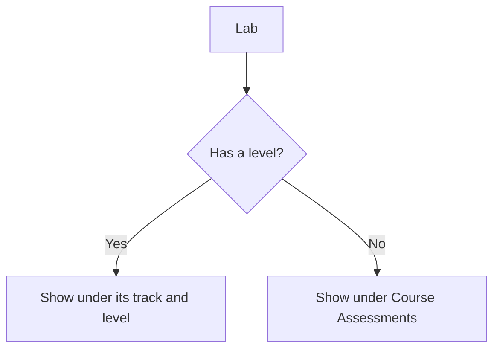
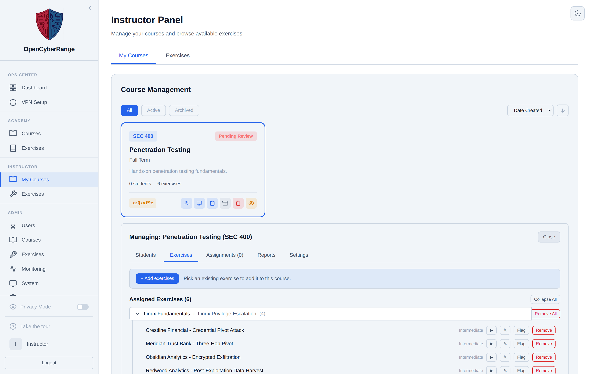

# Course Assessments

Course Assessments is the group that holds any lab without a track or level. You use the Categorize Exercise action to drop a lab into this bucket or to file it under a real track and level. A lab in Course Assessments still shows to enrolled students so they can open it.

## Prerequisites

- You are an instructor or administrator.
- The lab you want to categorize already exists in the Exercises catalog.

## How labs are grouped

Every lab is placed into a group based on whether it has a level. The flow below shows how the platform decides where a lab appears.

A lab with no level falls into the **Course Assessments** group, labeled with the level name Assessments. Course-only labs land here too and still surface in the course view so enrolled students can open them, even though they stay hidden from the main exercise list.

## Move a lab into or out of Course Assessments

1. In the left sidebar, select **Instructor Panel**.
2. Open the **Exercises** tab.
3. Find the lab and open its **Categorize Exercise** action.
4. Choose a destination:
   - Pick a track and level to file the lab there.
   - Pick **Course Assessments (no track)** to clear the level and drop it into the bucket.
5. Save the change.

**What you should see:** the lab moves to the chosen group. Filing it under a level lists it with that track and level; choosing Course Assessments removes the level and groups it under Assessments.

<figure markdown>

<figcaption>The Exercises tab groups assigned labs by track and level, with level-less labs collected under Course Assessments.</figcaption>
</figure>

## Categorize behavior

| Categorize choice | Effect on the lab |
|-------------------|-------------------|
| A specific track and level | The lab lists under that track and level |
| Course Assessments (no track) | The lab's level is cleared and it groups under Assessments |

!!! note
    Categorize is the only place to set or clear a lab's level. There is no separate level field on the lab itself.

!!! tip
    Use Course Assessments for one-off quizzes, capstones, or course-specific labs that do not belong to a structured track. Enrolled students still reach them from the course view.
