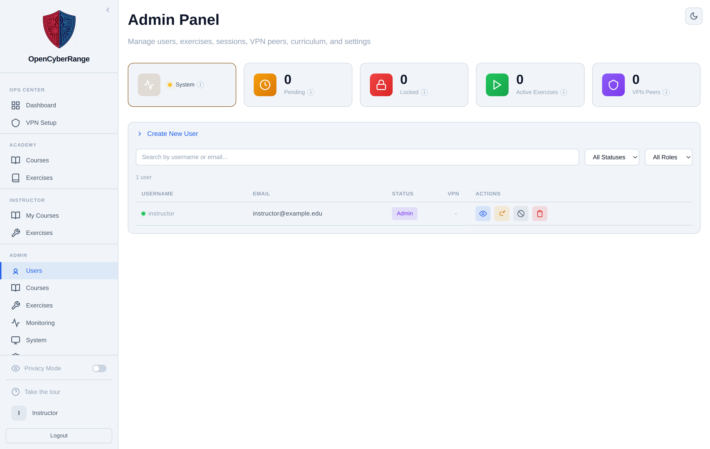
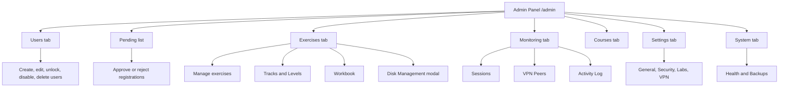

# Admin Panel Overview

The Admin Panel is the operator console for the platform. You open it to approve accounts, manage exercises, monitor live lab sessions, manage VPN peers, and change platform settings. Open it whenever you administer the range rather than play as a student.

!!! note "Edition limits"
    OCR-Lite runs with one privileged account, the administrator who also owns and manages courses, and up to five active courses at a time. Student accounts are unlimited. Archive a course to free a course slot.

## Prerequisites

- An account with the admin role. See [Logging In](../01_Getting_Started/05_Logging_In.md).

## Where the Admin Panel lives

The Admin Panel is reached at `/admin`. Sign in as an admin, then open the **Admin** section of the left sidebar. The sidebar exposes six admin links: **Users**, **Courses**, **Exercises**, **Monitoring**, **System**, and **Settings**, plus an external **Wiki** link. There is no top navigation bar; you move between areas from the sidebar.

The whole Admin Panel is one screen. Each sidebar link sets a `?tab=` value on the `/admin` route and swaps the main area, so Users is `/admin?tab=users`, Monitoring is `/admin?tab=monitoring`, and so on. The manual pages in this guide are task oriented, so several of them describe controls that live under the same tab.

<figure markdown>

<figcaption>The Admin Panel opens on the Users tab, with platform stat cards across the top and the left sidebar for navigation.</figcaption>
</figure>

## Stat cards

The top of the panel shows stat cards that summarize platform state:

| Card | Shows | Click action |
| --- | --- | --- |
| System / Firewall / Security | Health rollup; reads "Checking..." until health loads | Opens System Health |
| Pending | Count of accounts awaiting approval | Opens the Pending list |
| Locked | Count of locked accounts | Opens the Users tab |
| Active Exercises | Count of running lab sessions | Opens Monitoring |
| VPN Peers | Count of registered WireGuard peers | Opens Monitoring |

The Pending card is the only way to reach the pending list; there is no separate sidebar link for it. See [Approving New Users](02_Approving_New_Users.md).

## Tab and sub-tab map

The Admin Panel groups every operator task under seven tabs. Some tabs hold sub-tabs or sub-views; one opens a modal. The map below shows which tab holds each task this guide covers.

## Legacy deep links

Older bookmarks still resolve. The following query values redirect to the current location:

| Old link | Resolves to |
| --- | --- |
| `?tab=sessions` | Monitoring, Sessions sub-tab |
| `?tab=vpn` | Monitoring, VPN Peers sub-tab |
| `?tab=activity` | Monitoring, Activity Log sub-tab |
| `?tab=labs` | Exercises, manage view |
| `?tab=curriculum` | Exercises, Tracks and Levels view |

!!! note "Privacy mode masks identities"
    Privacy Mode is an optional toggle in the instructor and admin sidebar, off by default. Turn it on to mask usernames and emails in the Users table and any roster, session, or activity view, so you can share the panel during a class even when real accounts are present.

!!! tip "Health card reads Checking..."
    A health card that reads "Checking..." has not finished its first poll. Give it a moment, or open System Health directly from the card.
