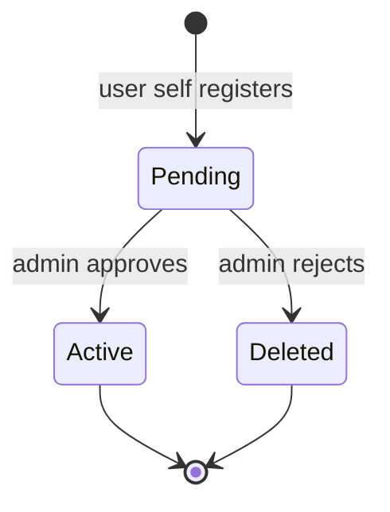
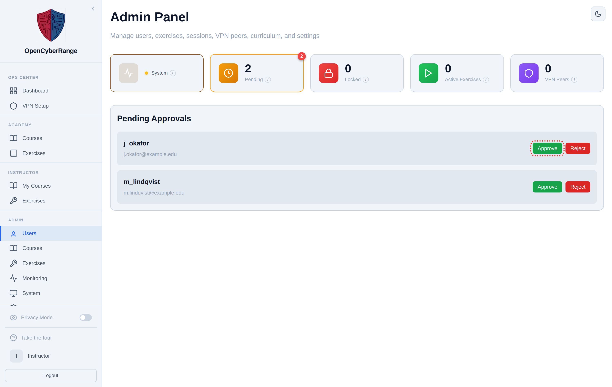

# Approving New Users

Registration is open, but every self-registered account lands in a holding state until an admin approves it. You approve new users to grant them access, or reject the ones that should not have an account. Do this whenever the Pending stat card shows a non-zero count.

## Prerequisites

- An admin account. See [Admin Panel Overview](01_Admin_Panel_Overview.md).

## How registration reaches you

When someone fills in the registration form, the platform creates the account with approval withheld. There is no email verification step and no invite gate on the platform account itself; admin approval is the only gate. The account does nothing until you act on it.

## Open the pending list

There is no Pending link in the sidebar. Reach the list from the **Pending** stat card.

1. Open the Admin Panel at `/admin`.
2. Click the **Pending** stat card at the top of the panel. The route becomes `/admin?tab=pending`.

**What you should see:** the **Pending Approvals** panel listing each account awaiting a decision, with its username and email (masked only if Privacy Mode is on). When nobody is waiting, the panel reads "No pending users".

<figure markdown>

<figcaption>The Pending Approvals list shows each self-registered account with an Approve and a Reject button.</figcaption>
</figure>

## Approve or reject

1. Review the identity for the row (masked if Privacy Mode is on).
2. Click **Approve** (green) to activate the account, or **Reject** (red) to remove it.

**What you should see:** the row disappears from the list and the Pending count on the stat card drops by one. An approved user can sign in immediately.

!!! warning "Reject is a hard delete"
    Reject does not soft-deny or quarantine the account. Reject removes the user record outright. Approve any account you intend to keep; reject only the ones that should never exist.

!!! tip "Confirm a real applicant first"
    Names and emails are masked in this list only when Privacy Mode is on, the optional sidebar toggle that is off by default. Open the user's details from the Users tab if you need to confirm who an applicant is before approving.

If an approved user cannot sign in, see [Login Issues](../07_Troubleshooting/01_Login_Issues.md).
