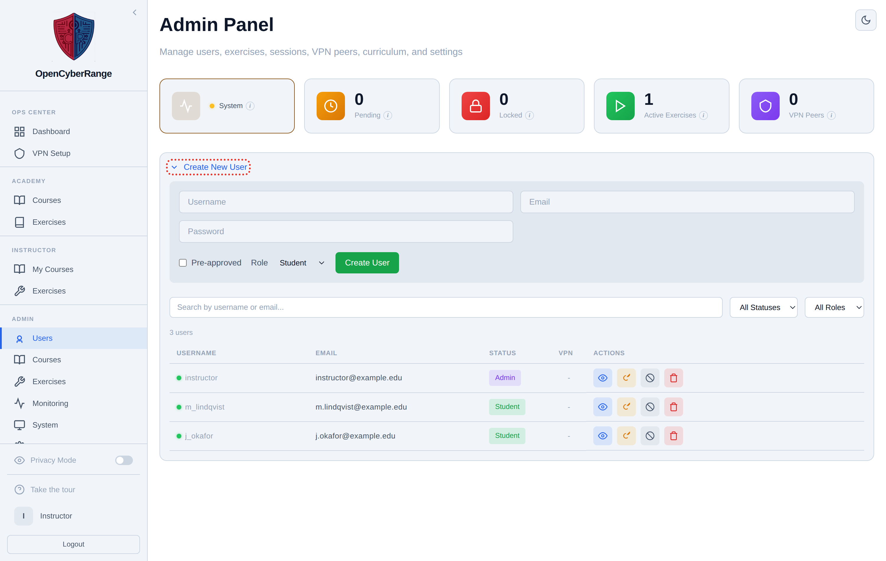
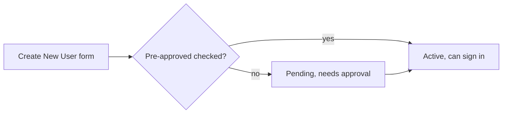

# Creating Users Manually

You create a user by hand when you want an account that does not start from the public registration form: an instructor account, a test account, or a student you want pre-approved so they skip the pending queue. Do this from the Users tab.

## Prerequisites

- An admin account. See [Admin Panel Overview](01_Admin_Panel_Overview.md).

## Open the create form

1. Open the Admin Panel and click **Users** in the sidebar. The route is `/admin?tab=users`.
2. Click **Create New User** at the top of the panel to expand the form. There is no separate screen; the form unfolds inline above the user table.

<figure markdown>

<figcaption>The Create New User form unfolds inline on the Users tab, above the searchable user table.</figcaption>
</figure>

## Fill in the account

1. Enter a **Username**.
2. Enter an **Email**. Use a test address such as `tester@university.edu` for throwaway accounts.
3. Enter a **Password**.
4. Optionally tick **Pre-approved** to skip the pending queue.
5. Choose a **Role**: Student, Instructor, or Admin. The role defaults to Student.
6. Click **Create User**.

**What you should see:** the account appears in the user table below. A pre-approved account is active at once; an account left un-approved lands in the pending list and still needs approval before the user can sign in.

!!! warning "No exclamation point in passwords"
    Do not use the `!` character inside a password. Use `#` instead. The exclamation point breaks shell handling in automated lab checks.

!!! note "Pre-approved is not the same as a role"
    Pre-approved only decides whether the account skips the pending queue. The Role select decides what the account can do. Granting the Admin role gives full operator access; choose it deliberately.

To approve an account you left un-approved, see [Approving New Users](02_Approving_New_Users.md). To change an account after creation, see [Editing User Accounts](04_Editing_User_Accounts.md).
