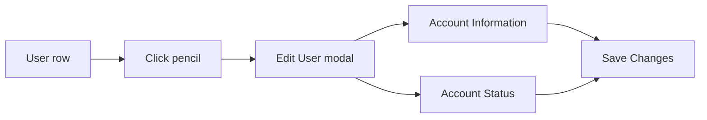

# Editing User Accounts

You edit a user to correct a username or email, change a role, flip approval or active state, or force a password change. Every per-account edit happens in one modal opened from the Users tab.

## Prerequisites

- An admin account. See [Admin Panel Overview](01_Admin_Panel_Overview.md).

## Open the Edit User modal

1. Open the Admin Panel and click **Users** in the sidebar (`/admin?tab=users`).
2. Find the account. Use the search box to match a username or email, or filter by status and role.
3. Click the **Edit User** action (the pencil icon) on the row.

**What you should see:** the **Edit User** modal opens, titled with the account's username and split into an Account Information section and an Account Status section.

## Fields you can change

| Field | Section | Effect |
| --- | --- | --- |
| Username | Account Information | Renames the login name |
| Email | Account Information | Changes the contact address |
| New Password | Account Information | Sets a new password; leave blank to keep the current one |
| Confirm New Password | Account Information | Must match the new password |
| Approved | Account Status | Toggles whether the account has passed approval |
| Role | Account Status | Student, Instructor, or Admin |
| Active | Account Status | Toggles whether the account can be used |
| Force password change on next login | Account Status | Requires a password change at the next sign-in |

The user table marks an account that must change its password with a lock badge in the Username cell.

## Save

1. Change the fields you need.
2. Click **Save Changes**.

**What you should see:** the modal reports success and the row in the table reflects the change.

!!! warning "Role changes can elevate to admin"
    Setting the Role to Admin gives the account full operator access to the Admin Panel. Change a role only when you mean to.

!!! warning "Never reset an active student"
    The New Password field changes the account's password. Never set a password on a real student account. Use a `@university.edu` test account or the `testadmin` account for any password example. See [Resetting User Passwords](06_Resetting_User_Passwords.md).

To unlock a locked account instead of editing it, see [Locking and Unlocking Users](05_Locking_and_Unlocking_Users.md). To remove an account, see [Deleting Users](07_Deleting_Users.md).
