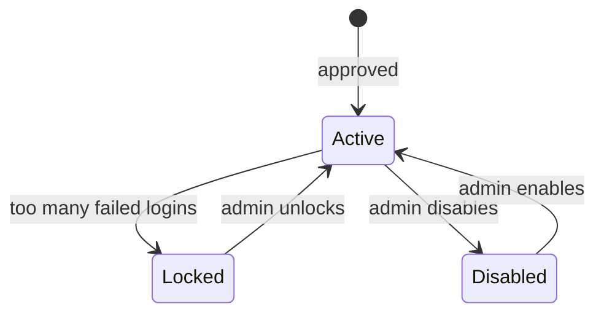
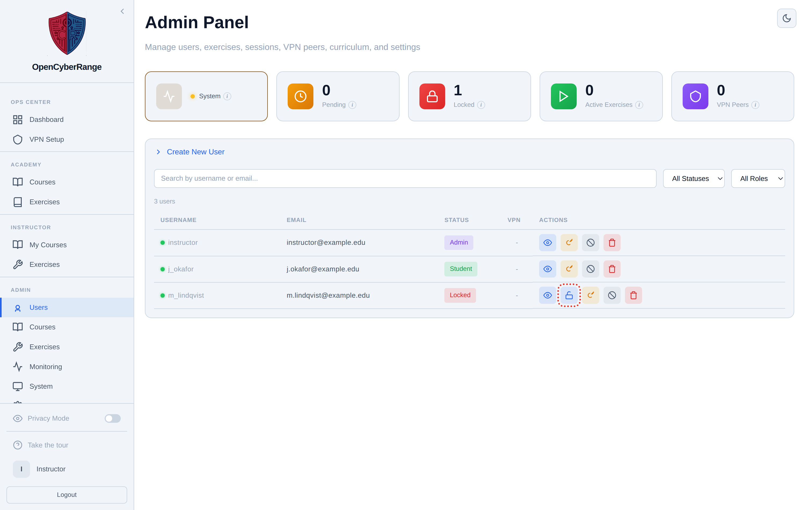

# Locking and Unlocking Users

An account locks itself after too many failed sign-ins. You unlock it from the Users tab so the person can sign in again. Do this when a user reports being shut out, or when the Locked stat card shows a non-zero count.

## Prerequisites

- An admin account. See [Admin Panel Overview](01_Admin_Panel_Overview.md).

## Locking is automatic

There is no manual lock button. The platform locks an account on its own after a run of failed login attempts. The lock is a defensive measure; you do not trigger it. To a student at the login screen the locked account still returns the generic "Incorrect username or password" message, which keeps an attacker from learning that an account exists or is locked.

Unlock is the only manual action. It is separate from disabling an account, which is a different control. The diagram shows how the two relate.

## Find locked accounts

1. Open the Admin Panel and click **Users** in the sidebar (`/admin?tab=users`).
2. In the status filter, choose **Locked**.

**What you should see:** the table narrows to accounts that currently carry a "Locked" badge. The Locked stat card at the top of the panel shows the same count.

<figure markdown>

<figcaption>Filtering the Users table by Locked status shows only locked accounts, each with an Unlock action.</figcaption>
</figure>

## Unlock the account

1. On the locked row, click the **Unlock** action (the open-padlock icon). The Unlock action appears only on rows that are locked.

**What you should see:** the "Locked" badge clears, the failed-attempt count resets, and the user can sign in again.

!!! note "Lock is not the same as disable"
    A locked account is one the platform shut out after failed logins; Unlock restores it. A disabled account is one you deliberately deactivated; you re-enable it with the Disable/Enable toggle, not Unlock. See [Deleting Users](07_Deleting_Users.md) for the disable control.

!!! tip "Confirm the credentials"
    Unlocking does not change the password. If the user keeps locking the account, the stored password may be wrong. See [Resetting User Passwords](06_Resetting_User_Passwords.md) and [Account Locked](../07_Troubleshooting/02_Account_Locked.md).
