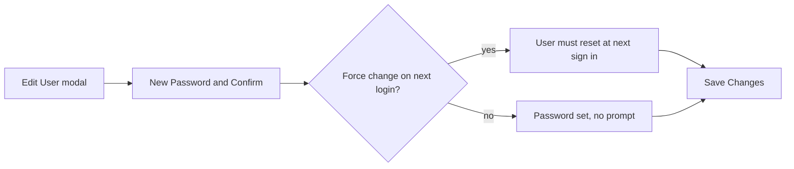

# Resetting User Passwords

You reset a password when a user cannot sign in and needs a known credential to recover, or when you set up a test or instructor account. The reset lives inside the Edit User modal, not as a separate row button.

## Prerequisites

- An admin account. See [Admin Panel Overview](01_Admin_Panel_Overview.md).

!!! warning "Never reset a real student"
    Resetting a password changes how a real person signs in and is a policy violation. Never reset a real student account. Use a `@university.edu` test account or the `testadmin` account for every reset you document or rehearse. When you need to act as a student for troubleshooting, use the read-only View As feature instead of changing their credentials.

## Set a new password

1. Open the Admin Panel and click **Users** in the sidebar (`/admin?tab=users`).
2. Find the account, for example a test student such as `taylor_nguyen@university.edu`.
3. Click the **Edit User** action (the pencil icon) to open the modal.
4. In the Account Information section, type the new password in **New Password** and repeat it in **Confirm New Password**. Leaving both blank keeps the current password.
5. Optionally tick **Force password change on next login** in the Account Status section so the user must set their own password the next time they sign in.
6. Click **Save Changes**.

**What you should see:** the modal confirms the save. If you ticked the force-change option, the user's row shows a lock badge in the Username cell, and the user is prompted to change the password at their next sign-in.

!!! warning "No exclamation point in passwords"
    Do not use `!` in a password value. Use `#` instead.

To change other account fields, see [Editing User Accounts](04_Editing_User_Accounts.md). If the user keeps getting locked out after a reset, see [Account Locked](../07_Troubleshooting/02_Account_Locked.md).
