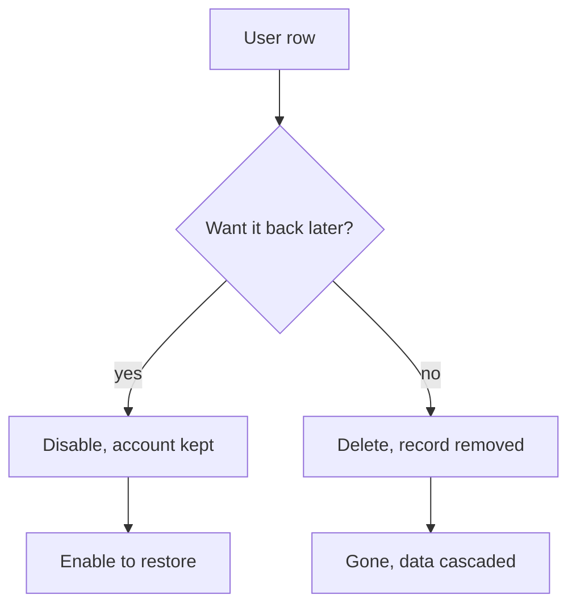

# Deleting Users

You delete a user to remove a throwaway or duplicate account for good. Deletion is permanent and removes the account's data with it, so prefer disabling an account when you only want to stop someone from signing in.

## Prerequisites

- An admin account. See [Admin Panel Overview](01_Admin_Panel_Overview.md).

## Delete versus disable

Two row actions remove access in different ways. Disable is reversible; Delete is not.

| Action | Control | Effect | Reversible |
| --- | --- | --- | --- |
| Disable | Disable/Enable toggle | Deactivates the account; it cannot sign in but the record stays | Yes, re-enable from the same toggle |
| Delete | Trash icon | Removes the account and cascades to its sessions, enrollments, and progress | No |

## Disable an account

1. Open the Admin Panel and click **Users** in the sidebar (`/admin?tab=users`).
2. On the row, click the **Disable** action. The same control reads **Enable** for an account that is already disabled.

**What you should see:** the row marks the account inactive. The Disabled status filter lists it, and the user can no longer sign in until you enable it again.

## Delete an account

1. Find the account on the Users tab.
2. Click the **Delete** action (the trash icon) on the row.
3. Confirm the deletion when prompted.

**What you should see:** the row disappears and the account is gone. Rejecting a pending account from the [Pending list](02_Approving_New_Users.md) performs the same delete.

!!! warning "Delete cascades and cannot be undone"
    Deleting a user removes that account's lab sessions, course enrollments, and progress along with the record. Never delete a real student. When in doubt, disable instead.

To deactivate without removing data, use Disable above. To change account details, see [Editing User Accounts](04_Editing_User_Accounts.md).
