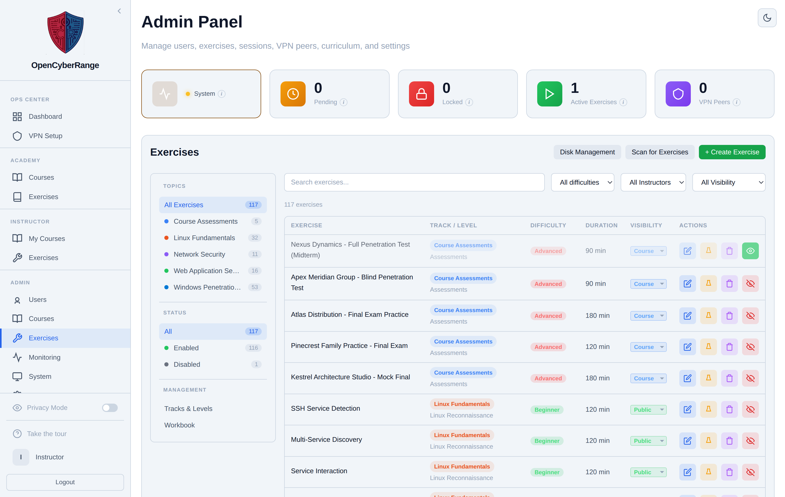
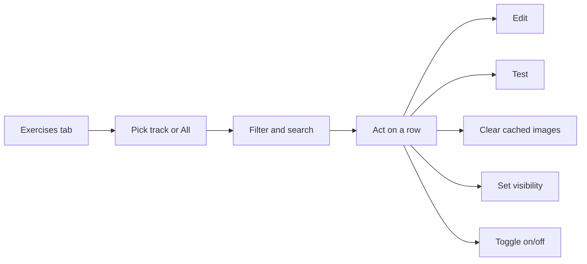

# Managing Labs

The Exercises tab is where you browse, filter, and act on every lab on the platform. You work here to find an exercise, change its visibility, run a quick test, clear cached images, or open it for editing. The platform calls each lab an Exercise.

## Prerequisites

- An admin account. See [Admin Panel Overview](01_Admin_Panel_Overview.md).

## Open the Exercises tab

1. Open the Admin Panel and click **Exercises** in the sidebar. The route is `/admin?tab=exercises`.

**What you should see:** the Exercises panel with a left sidebar (Topics, Status, Management), header buttons, and the exercise table.

<figure markdown>

<figcaption>The Exercises tab lists every exercise, with a left sidebar for topic, status, and management views.</figcaption>
</figure>

## Header buttons

| Button | Action |
| --- | --- |
| Disk Management | Opens the Docker images and build-cache modal |
| Scan for Exercises | Runs lab discovery to pick up new or changed lab definitions |
| + Create Exercise | Opens the modal to define a new exercise |

## Filter and find an exercise

The left sidebar narrows the list:

- **Topics** filters by track, or shows **All Exercises**.
- **Status** filters by Enabled or Disabled, or shows All.
- **Management** switches to the **Tracks & Levels** and **Workbook** views.

The filter bar above the table adds a search box, a difficulty filter, an instructor filter, and a visibility filter.

## Per-row actions

Each exercise row carries these actions:

| Action | Effect |
| --- | --- |
| Edit exercise (pencil) | Opens the Edit Exercise modal. See [Editing Lab Metadata](10_Editing_Lab_Metadata.md) |
| Delete cached Docker images (trash) | Clears the cached image so the next spawn rebuilds |
| Disable/Enable toggle (eye) | Turns the exercise on or off. See [Enabling and Disabling Labs](09_Enabling_and_Disabling_Labs.md) |

The Visibility select in each row sets Public, Course, Pending, or Draft.

!!! tip "Scan for Exercises picks up new labs"
    After adding or changing a lab definition on disk, click **Scan for Exercises** to register it. Discovery may report scan warnings, which appear in a dismissible banner above the table.

!!! warning "Stale cached images hide changes"
    A cached lab image can mask a changed Dockerfile, so the next spawn runs the old build. Click the per-row **Delete cached Docker images** action to force a rebuild on the next spawn.
