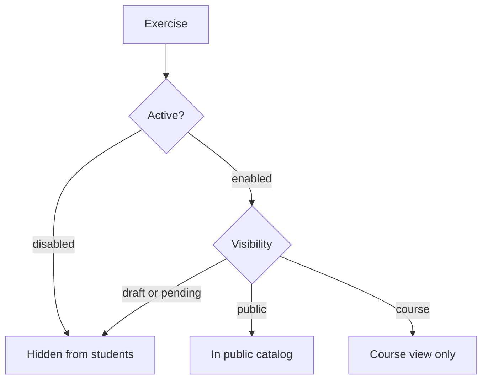

# Enabling and Disabling Labs

You enable an exercise to make it available and disable one to take it out of circulation. The toggle is one of two independent gates that decide whether a student sees an exercise; the other is visibility. Knowing the difference keeps you from hiding a lab you meant to publish.

## Prerequisites

- An admin account. See [Admin Panel Overview](01_Admin_Panel_Overview.md).
- The Exercises tab. See [Managing Labs](08_Managing_Labs.md).

## Two independent gates

An exercise reaches a student only when both gates allow it.

| Gate | Values | Set from |
| --- | --- | --- |
| Active state | Enabled or Disabled | The eye toggle on the row, or bulk toggle |
| Visibility | Public, Course, Pending, Draft | The Visibility select on the row |

A disabled exercise is hidden from students no matter what its visibility says. An enabled exercise still respects its visibility: a Draft or Course exercise does not appear in the public catalog even when enabled.

## Enable or disable one exercise

1. On the Exercises tab, use the **Status** sidebar to filter to **Disabled** or **Enabled**, or search for the exercise.
2. Click the **Disable/Enable** toggle (the eye icon) on the row. The tooltip reads "Enable" on a disabled row and "Disable" on an enabled one.

**What you should see:** the row's state flips. A disabled row appears dimmed and moves under the Disabled status filter; an enabled row appears under Enabled.

<figure markdown>

<figcaption>The Status sidebar separates enabled from disabled exercises, and the eye toggle flips an exercise's active state.</figcaption>
</figure>

!!! note "Visibility is set separately"
    To publish or hide an exercise without disabling it, change the Visibility select on the row rather than the eye toggle. The two settings are independent.

To change an exercise's name, difficulty, or track placement, see [Editing Lab Metadata](10_Editing_Lab_Metadata.md).
